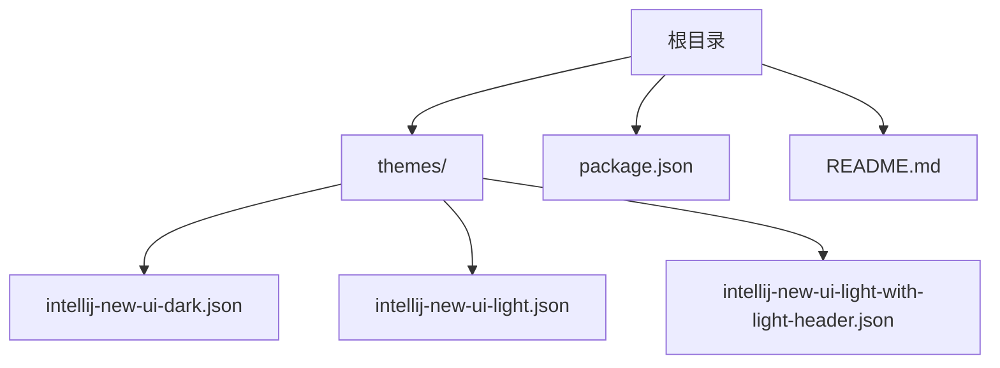
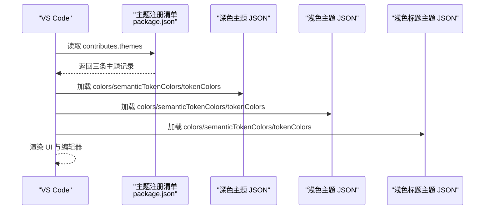
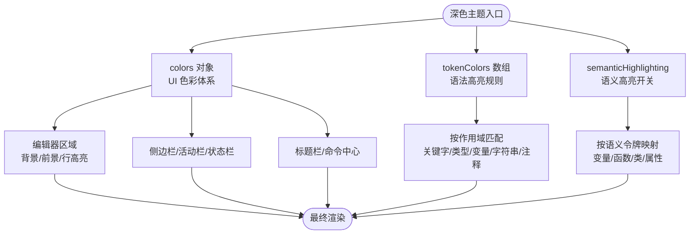
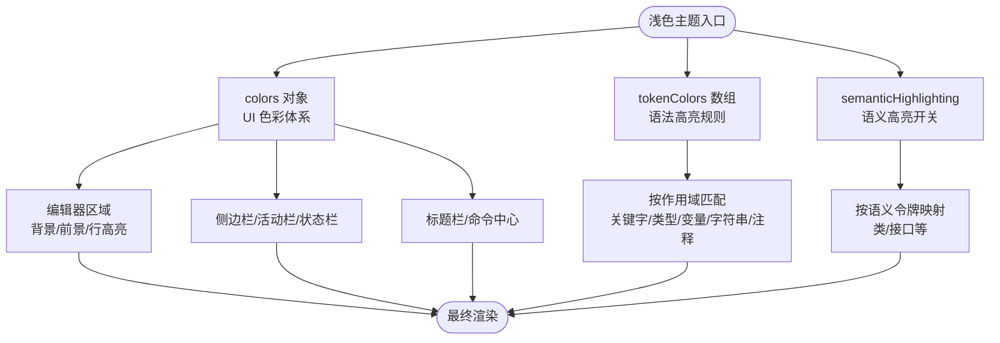
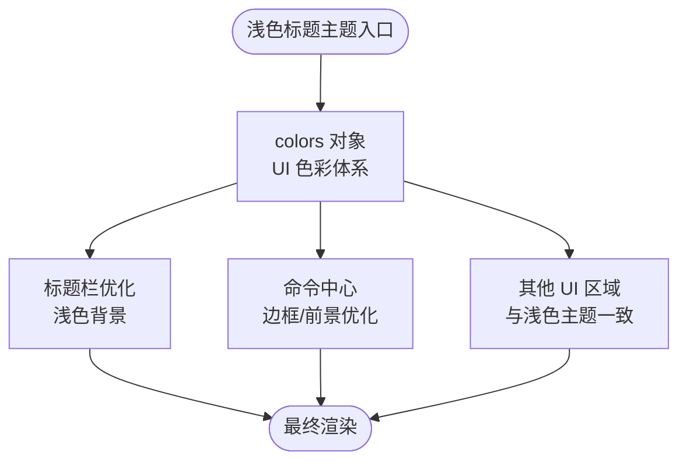
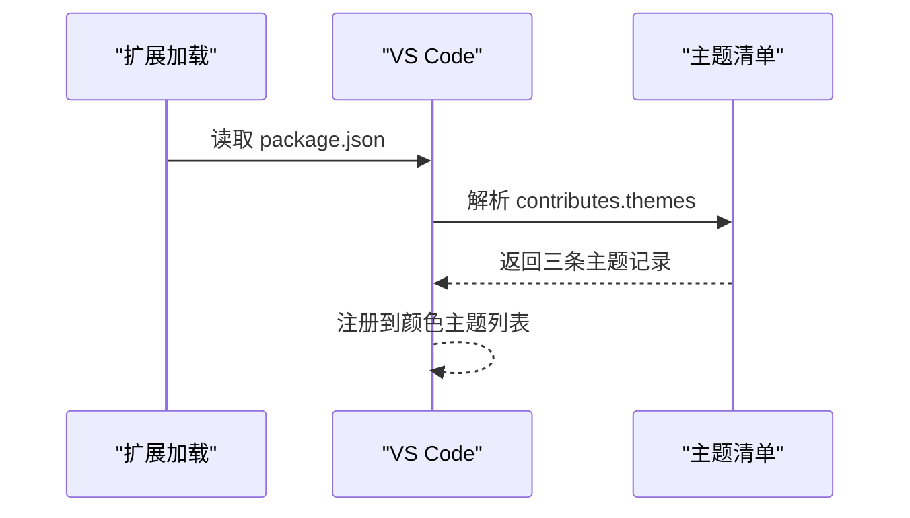
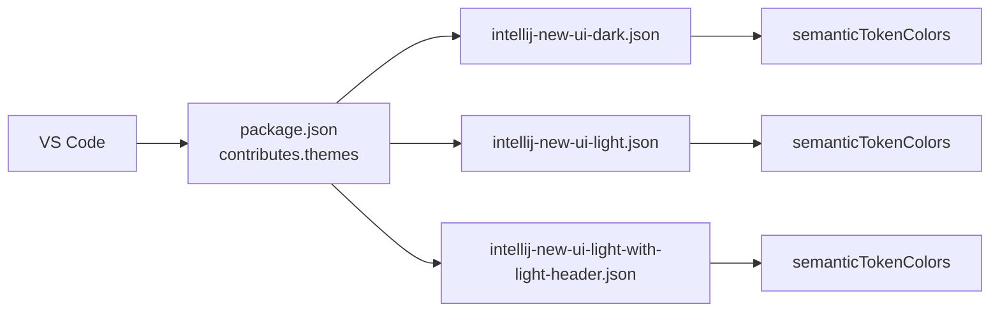

# 主题特性

<cite>
**本文引用的文件**
- [themes/intellij-new-ui-dark.json](file://themes/intellij-new-ui-dark.json)
- [themes/intellij-new-ui-light.json](file://themes/intellij-new-ui-light.json)
- [themes/intellij-new-ui-light-with-light-header.json](file://themes/intellij-new-ui-light-with-light-header.json)
- [package.json](file://package.json)
- [README.md](file://README.md)
</cite>

## 目录
1. [简介](#简介)
2. [项目结构](#项目结构)
3. [核心组件](#核心组件)
4. [架构总览](#架构总览)
5. [详细组件分析](#详细组件分析)
6. [依赖关系分析](#依赖关系分析)
7. [性能考量](#性能考量)
8. [故障排查指南](#故障排查指南)
9. [结论](#结论)
10. [附录](#附录)

## 简介
本主题包旨在复刻 IntelliJ IDEA 新界面的美学风格，提供三种主题变体：
- 深色主题：面向夜间或低光环境，强调对比度与层次感。
- 浅色主题：通用浅色界面，突出编辑器与工具栏的现代感。
- 浅色标题主题：在浅色主题基础上，进一步优化标题栏与命令中心的浅色显示效果，使其在浅背景上更清晰可读。

这些主题通过 VS Code 的主题注册机制对外暴露，用户可在设置中选择并应用。

## 项目结构
主题文件位于 themes 目录下，分别对应三种变体；主题注册信息集中在 package.json 的 contributes.themes 字段中；README 提供简要说明与预览图。

图表来源
- [package.json](file://package.json#L18-L36)
- [themes/intellij-new-ui-dark.json](file://themes/intellij-new-ui-dark.json#L1-L20)
- [themes/intellij-new-ui-light.json](file://themes/intellij-new-ui-light.json#L1-L20)
- [themes/intellij-new-ui-light-with-light-header.json](file://themes/intellij-new-ui-light-with-light-header.json#L1-L20)

章节来源
- [package.json](file://package.json#L18-L36)
- [README.md](file://README.md#L1-L19)

## 核心组件
本节从两个维度解析主题文件：UI 色彩体系（colors 对象）与语法高亮体系（tokenColors 数组），并说明语义高亮（semanticHighlighting）支持情况。

- UI 色彩体系（colors）
  - 定义范围覆盖标题栏、菜单栏、活动栏、侧边栏、面板、状态栏、编辑器区域、标签页、滚动条、通知与建议弹窗等。
  - 每个组件使用明确的键名，例如 editor.background、editor.foreground、sideBar.background、statusBar.background 等，确保一致的视觉语言。
  - 深色主题采用较深的背景与中性前景色，强调功能区边界与选中态；浅色主题采用明亮背景与深色前景，提升可读性与对比度。

- 语法高亮体系（tokenColors）
  - 使用“作用域(scope)”匹配不同语言元素，如关键字、类型、变量、字符串、注释、正则、HTML/CSS/JS 等。
  - 每条规则包含前景色与可选的字体样式（如斜体、粗体、删除线），用于增强可读性与层级感。
  - tokenColors 为 VS Code 传统语法高亮方案，适用于广泛的语言生态。

- 语义高亮（semanticHighlighting）
  - 三款主题均开启 semanticHighlighting，启用后由语言服务器提供语义令牌，主题再通过 semanticTokenColors 进行渲染。
  - 语义高亮能区分变量、函数、类、属性等语义实体，避免仅凭词法分析导致的误判，显著提升复杂代码的可读性与一致性。

章节来源
- [themes/intellij-new-ui-dark.json](file://themes/intellij-new-ui-dark.json#L1-L284)
- [themes/intellij-new-ui-light.json](file://themes/intellij-new-ui-light.json#L1-L139)
- [themes/intellij-new-ui-light-with-light-header.json](file://themes/intellij-new-ui-light-with-light-header.json#L1-L137)
- [themes/intellij-new-ui-dark.json](file://themes/intellij-new-ui-dark.json#L285-L330)
- [themes/intellij-new-ui-light.json](file://themes/intellij-new-ui-light.json#L728-L738)
- [themes/intellij-new-ui-light-with-light-header.json](file://themes/intellij-new-ui-light-with-light-header.json#L726-L736)

## 架构总览
主题注册与加载流程如下：
- package.json 的 contributes.themes 声明三条主题记录，分别指向三款主题 JSON 文件。
- VS Code 在启动时读取该清单，将主题暴露到“首选项 > 颜色主题”列表中，用户可直接切换。
- 应用主题时，VS Code 将 colors 中的 UI 颜色与 tokenColors/semanticTokenColors 合并到编辑器与 UI 组件中。

图表来源
- [package.json](file://package.json#L18-L36)
- [themes/intellij-new-ui-dark.json](file://themes/intellij-new-ui-dark.json#L1-L20)
- [themes/intellij-new-ui-light.json](file://themes/intellij-new-ui-light.json#L1-L20)
- [themes/intellij-new-ui-light-with-light-header.json](file://themes/intellij-new-ui-light-with-light-header.json#L1-L20)

## 详细组件分析

### 深色主题（intellij-new-ui-dark.json）
- 整体色调
  - 背景与边框多采用深灰/近黑，强调层次与聚焦；标题栏、活动栏、侧边栏、状态栏等均使用统一的深色系，保证在暗背景下的一致性。
  - 编辑器区域采用较深背景，辅以中性前景色，减少眩光并提升长时间编码体验。
- 关键 UI 键位示例（路径引用）
  - 编辑器背景与前景：见 [colors.editor.background](file://themes/intellij-new-ui-dark.json#L164-L166)、[colors.editor.foreground](file://themes/intellij-new-ui-dark.json#L164-L166)
  - 侧边栏背景与前景：见 [colors.sideBar.background](file://themes/intellij-new-ui-dark.json#L45-L47)、[colors.sideBar.foreground](file://themes/intellij-new-ui-dark.json#L45-L47)
  - 标题栏背景与前景：见 [colors.titleBar.activeBackground](file://themes/intellij-new-ui-dark.json#L5-L6)、[colors.titleBar.inactiveBackground](file://themes/intellij-new-ui-dark.json#L5-L6)
  - 状态栏背景与前景：见 [colors.statusBar.background](file://themes/intellij-new-ui-dark.json#L99-L101)、[colors.statusBar.foreground](file://themes/intellij-new-ui-dark.json#L99-L101)
  - 活动栏与边框：见 [colors.activityBar.background](file://themes/intellij-new-ui-dark.json#L33-L35)、[colors.activityBar.border](file://themes/intellij-new-ui-dark.json#L33-L35)
- 语法高亮（tokenColors）
  - 注释、关键字、类型、变量、字符串、正则、HTML/CSS/JS 等均有明确作用域与配色，部分规则包含斜体/粗体等样式修饰，帮助快速识别语法层级。
  - 示例路径：
    - 关键字与存储：见 [token scope 关键词集合](file://themes/intellij-new-ui-dark.json#L362-L386)
    - 变量与常量：见 [token scope 变量集合](file://themes/intellij-new-ui-dark.json#L395-L416)
    - 字符串与正则：见 [token scope 字符串集合](file://themes/intellij-new-ui-dark.json#L431-L449)、[token scope 正则集合](file://themes/intellij-new-ui-dark.json#L451-L460)
    - HTML/CSS/JS：见 [token scope HTML/CSS/JS 多处](file://themes/intellij-new-ui-dark.json#L461-L621)
- 语义高亮（semanticHighlighting）
  - 开启并提供语义令牌颜色映射，覆盖 namespace、variable、parameter、type、interface、class、property 等，部分默认库符号采用斜体以示区分。
  - 示例路径：
    - 语义高亮开关：见 [semanticHighlighting](file://themes/intellij-new-ui-dark.json#L285-L286)
    - 语义令牌颜色：见 [semanticTokenColors](file://themes/intellij-new-ui-dark.json#L287-L329)

图表来源
- [themes/intellij-new-ui-dark.json](file://themes/intellij-new-ui-dark.json#L1-L284)
- [themes/intellij-new-ui-dark.json](file://themes/intellij-new-ui-dark.json#L285-L330)

章节来源
- [themes/intellij-new-ui-dark.json](file://themes/intellij-new-ui-dark.json#L1-L330)

### 浅色主题（intellij-new-ui-light.json）
- 整体色调
  - 采用明亮背景与深色前景，强调清晰度与可读性；编辑器、侧边栏、标签页、活动栏、状态栏等均使用浅色系，营造轻盈的视觉感受。
- 关键 UI 键位示例（路径引用）
  - 编辑器背景与前景：见 [colors.editor.background](file://themes/intellij-new-ui-light.json#L11-L13)、[colors.editor.foreground](file://themes/intellij-new-ui-light.json#L11-L13)
  - 侧边栏背景与前景：见 [colors.sideBar.background](file://themes/intellij-new-ui-light.json#L41-L43)、[colors.sideBar.foreground](file://themes/intellij-new-ui-light.json#L41-L43)
  - 标题栏背景与前景：见 [colors.titleBar.activeBackground](file://themes/intellij-new-ui-light.json#L82-L85)、[colors.titleBar.inactiveBackground](file://themes/intellij-new-ui-light.json#L82-L85)
  - 状态栏背景与前景：见 [colors.statusBar.background](file://themes/intellij-new-ui-light.json#L71-L73)、[colors.statusBar.foreground](file://themes/intellij-new-ui-light.json#L71-L73)
  - 活动栏与边框：见 [colors.activityBar.background](file://themes/intellij-new-ui-light.json#L65-L69)、[colors.activityBar.foreground](file://themes/intellij-new-ui-light.json#L65-L69)
- 语法高亮（tokenColors）
  - 注释、关键字、类型、变量、字符串、HTML/CSS/JS 等均有覆盖，部分规则包含粗体/斜体/下划线等样式，提升可读性。
  - 示例路径：
    - 注释与预处理：见 [token scope 注释集合](file://themes/intellij-new-ui-light.json#L148-L163)
    - 关键字与存储：见 [token scope 关键词集合](file://themes/intellij-new-ui-light.json#L198-L206)
    - 类型与常量：见 [token scope 类型集合](file://themes/intellij-new-ui-light.json#L210-L218)
    - 变量与函数：见 [token scope 变量/函数集合](file://themes/intellij-new-ui-light.json#L231-L261)
    - 字符串与正则：见 [token scope 字符串集合](file://themes/intellij-new-ui-light.json#L289-L301)、[token scope 正则集合](file://themes/intellij-new-ui-light.json#L305-L308)
    - HTML/CSS/JS：见 [token scope HTML/CSS/JS 多处](file://themes/intellij-new-ui-light.json#L336-L728)
- 语义高亮（semanticHighlighting）
  - 开启并提供基础语义令牌颜色映射，覆盖 class、interface 等，保持与深色主题一致的语义识别能力。
  - 示例路径：
    - 语义高亮开关：见 [semanticHighlighting](file://themes/intellij-new-ui-light.json#L728-L729)
    - 语义令牌颜色：见 [semanticTokenColors](file://themes/intellij-new-ui-light.json#L730-L738)

图表来源
- [themes/intellij-new-ui-light.json](file://themes/intellij-new-ui-light.json#L1-L139)
- [themes/intellij-new-ui-light.json](file://themes/intellij-new-ui-light.json#L140-L738)
- [themes/intellij-new-ui-light.json](file://themes/intellij-new-ui-light.json#L728-L738)

章节来源
- [themes/intellij-new-ui-light.json](file://themes/intellij-new-ui-light.json#L1-L738)

### 浅色标题主题（intellij-new-ui-light-with-light-header.json）
- 设计目标
  - 在浅色主题基础上，专门优化标题栏与命令中心的浅色显示效果，使标题栏在浅背景上仍具备足够的对比度与可读性。
- 关键差异点（路径引用）
  - 标题栏背景：将标题栏 active/inactive 背景改为浅色，避免与编辑器区域产生视觉割裂。
    - 见 [colors.titleBar.activeBackground](file://themes/intellij-new-ui-light-with-light-header.json#L82-L84)、[colors.titleBar.inactiveBackground](file://themes/intellij-new-ui-light-with-light-header.json#L82-L84)
  - 命令中心颜色：保留命令中心的深色主色调，但调整边框与前景，确保在浅标题栏背景上的一致性与可辨识度。
    - 见 [colors.commandCenter.*](file://themes/intellij-new-ui-light-with-light-header.json#L85-L91)
- 其他 UI 键位与浅色主题一致，详见浅色主题章节。

图表来源
- [themes/intellij-new-ui-light-with-light-header.json](file://themes/intellij-new-ui-light-with-light-header.json#L81-L91)

章节来源
- [themes/intellij-new-ui-light-with-light-header.json](file://themes/intellij-new-ui-light-with-light-header.json#L1-L137)

### 主题注册与暴露（package.json）
- contributes.themes 字段声明三条主题记录，分别指定主题标签、UI 主题类型（vs-dark vs）与 JSON 路径。
- VS Code 在扩展安装后自动读取该清单，将其加入颜色主题列表，用户可通过“首选项 > 颜色主题”进行切换。

图表来源
- [package.json](file://package.json#L18-L36)

章节来源
- [package.json](file://package.json#L18-L36)

## 依赖关系分析
- 主题文件之间的耦合度极低，彼此独立存在，互不影响。
- VS Code 与主题文件之间通过 package.json 的主题注册形成单向依赖：VS Code 依赖主题 JSON 提供 UI 与语法高亮配置。
- 语义高亮依赖语言服务器提供的语义令牌，主题仅负责渲染。

图表来源
- [package.json](file://package.json#L18-L36)
- [themes/intellij-new-ui-dark.json](file://themes/intellij-new-ui-dark.json#L285-L330)
- [themes/intellij-new-ui-light.json](file://themes/intellij-new-ui-light.json#L728-L738)
- [themes/intellij-new-ui-light-with-light-header.json](file://themes/intellij-new-ui-light-with-light-header.json#L726-L736)

章节来源
- [package.json](file://package.json#L18-L36)
- [themes/intellij-new-ui-dark.json](file://themes/intellij-new-ui-dark.json#L285-L330)
- [themes/intellij-new-ui-light.json](file://themes/intellij-new-ui-light.json#L728-L738)
- [themes/intellij-new-ui-light-with-light-header.json](file://themes/intellij-new-ui-light-with-light-header.json#L726-L736)

## 性能考量
- 语义高亮（semanticHighlighting）会增加语言服务器的负担，但在大多数现代设备上影响有限。若遇到性能问题，可考虑关闭语义高亮或降低语言服务的活跃度。
- tokenColors 的作用域匹配数量与复杂度会影响渲染性能。本主题已针对常见语言做了覆盖，通常无需额外优化。
- 标题栏与命令中心的浅色优化主要体现在色彩对比度，不会带来额外的计算开销。

## 故障排查指南
- 主题未出现在颜色主题列表
  - 检查 package.json 的 contributes.themes 是否正确声明，路径是否指向实际存在的 JSON 文件。
  - 参考路径：[contributes.themes](file://package.json#L18-L36)
- 标题栏或命令中心颜色异常
  - 深色主题与浅色主题的标题栏/命令中心颜色不同，确认选择了正确的主题。
  - 参考路径：
    - [深色主题标题栏/命令中心](file://themes/intellij-new-ui-dark.json#L5-L22)
    - [浅色主题标题栏/命令中心](file://themes/intellij-new-ui-light.json#L81-L93)
    - [浅色标题主题标题栏/命令中心](file://themes/intellij-new-ui-light-with-light-header.json#L81-L91)
- 语法高亮不生效或不完整
  - 确认已启用语义高亮（semanticHighlighting），并确保语言服务器正常工作。
  - 参考路径：
    - [深色主题语义高亮](file://themes/intellij-new-ui-dark.json#L285-L286)
    - [浅色主题语义高亮](file://themes/intellij-new-ui-light.json#L728-L729)
    - [浅色标题主题语义高亮](file://themes/intellij-new-ui-light-with-light-header.json#L726-L727)
- 自定义颜色覆盖
  - VS Code 支持用户设置覆盖主题颜色。若需微调，可在用户设置中添加对应键名与颜色值，覆盖主题默认值。
  - 示例键名（路径引用）：
    - 编辑器背景与前景：见 [colors.editor.background](file://themes/intellij-new-ui-dark.json#L164-L166)、[colors.editor.foreground](file://themes/intellij-new-ui-dark.json#L164-L166)
    - 侧边栏背景与前景：见 [colors.sideBar.background](file://themes/intellij-new-ui-dark.json#L45-L47)、[colors.sideBar.foreground](file://themes/intellij-new-ui-dark.json#L45-L47)
    - 标题栏背景与前景：见 [colors.titleBar.activeBackground](file://themes/intellij-new-ui-dark.json#L5-L6)、[colors.titleBar.inactiveBackground](file://themes/intellij-new-ui-dark.json#L5-L6)

章节来源
- [package.json](file://package.json#L18-L36)
- [themes/intellij-new-ui-dark.json](file://themes/intellij-new-ui-dark.json#L164-L166)
- [themes/intellij-new-ui-dark.json](file://themes/intellij-new-ui-dark.json#L45-L47)
- [themes/intellij-new-ui-dark.json](file://themes/intellij-new-ui-dark.json#L5-L6)
- [themes/intellij-new-ui-light.json](file://themes/intellij-new-ui-light.json#L81-L93)
- [themes/intellij-new-ui-light-with-light-header.json](file://themes/intellij-new-ui-light-with-light-header.json#L81-L91)

## 结论
本主题包通过三款变体覆盖不同使用场景：深色主题适合夜间/低光环境，浅色主题适合日常明亮环境，浅色标题主题则专注于标题栏与命令中心在浅背景上的可读性优化。它们共同遵循 VS Code 主题规范，借助 colors、tokenColors 与 semanticHighlighting 实现一致且高质量的视觉体验。对于初学者，推荐从浅色主题入手；对于高级用户，可结合语义高亮与用户设置进行深度定制。

## 附录
- 主题注册清单位置：见 [contributes.themes](file://package.json#L18-L36)
- 三款主题文件路径：
  - [intellij-new-ui-dark.json](file://themes/intellij-new-ui-dark.json)
  - [intellij-new-ui-light.json](file://themes/intellij-new-ui-light.json)
  - [intellij-new-ui-light-with-light-header.json](file://themes/intellij-new-ui-light-with-light-header.json)
- README 说明与预览图：见 [README.md](file://README.md#L1-L19)