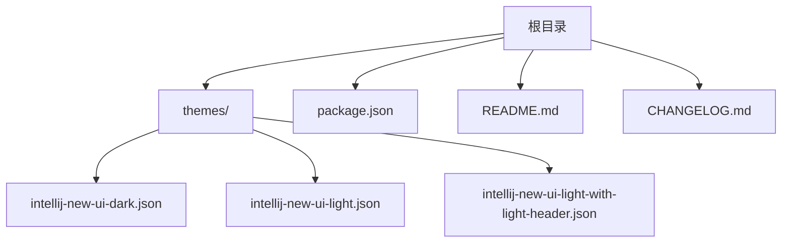
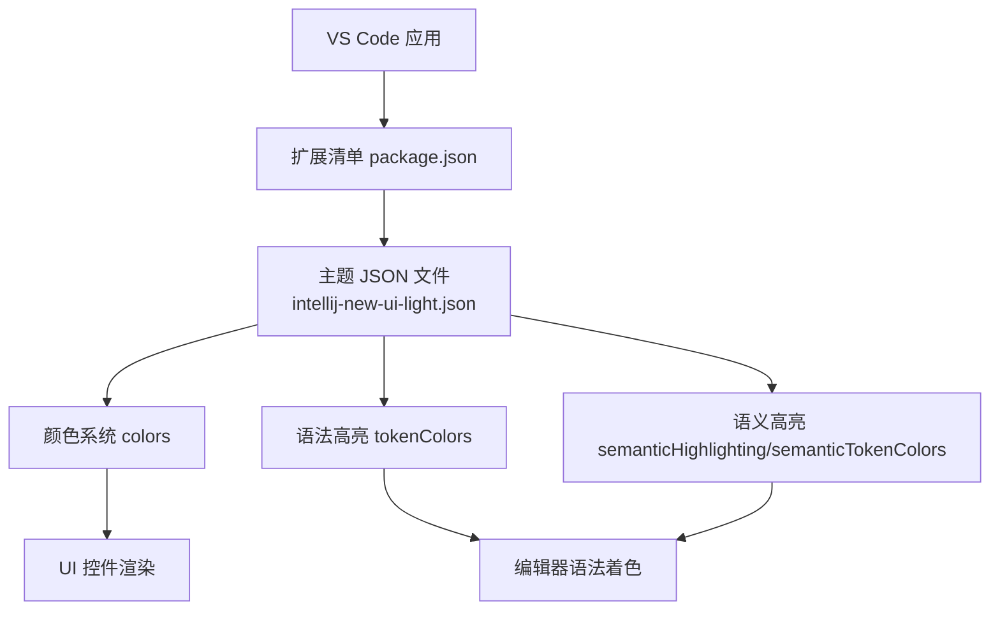
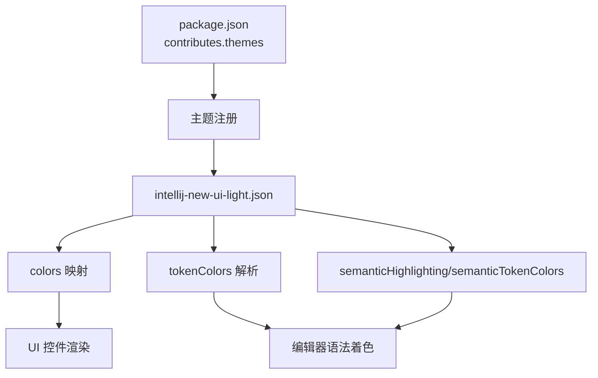

# 浅色主题

<cite>
**本文引用的文件**
- [themes/intellij-new-ui-light.json](file://themes/intellij-new-ui-light.json)
- [themes/intellij-new-ui-light-with-light-header.json](file://themes/intellij-new-ui-light-with-light-header.json)
- [package.json](file://package.json)
- [README.md](file://README.md)
- [CHANGELOG.md](file://CHANGELOG.md)
</cite>

## 目录
1. [简介](#简介)
2. [项目结构](#项目结构)
3. [核心组件](#核心组件)
4. [架构总览](#架构总览)
5. [详细组件分析](#详细组件分析)
6. [依赖关系分析](#依赖关系分析)
7. [性能考量](#性能考量)
8. [故障排查指南](#故障排查指南)
9. [结论](#结论)
10. [附录](#附录)

## 简介
本文件围绕浅色主题“IntelliJ IDEA New UI Light”展开，基于主题文件与扩展清单进行系统化解读。该主题旨在复刻 IntelliJ IDEA 新 UI 的视觉风格，提供统一的浅色系配色与语法高亮体系，并通过 VS Code 扩展机制以“vs”UI 主题形式注册发布。文档将重点解析：
- 颜色方案：从基础控件到编辑器、侧边栏、标签页、状态栏、标题栏等区域的颜色映射，以及与 IntelliJ IDEA 视觉一致性的对比设计。
- 语法高亮：tokenColors 的作用域与样式设置，覆盖注释、关键字、类型、变量、函数、类、异常、字符串、正则、HTML/CSS 标签、Markdown、Diff 等常见语言元素。
- 语义高亮：semanticHighlighting 与 semanticTokenColors 的启用与基础配置，为后续扩展提供空间。
- 注册方式：通过 package.json 中 uiTheme: "vs" 将主题注册为 VS Code 的浅色主题之一。

## 项目结构
该仓库采用按功能分层的组织方式：
- themes 目录存放三款主题 JSON 文件，分别对应深色、浅色与浅色带浅色标题栏的变体。
- package.json 定义扩展元数据与主题注册信息。
- README.md 与 CHANGELOG.md 提供项目介绍与版本变更记录。

图表来源
- [package.json](file://package.json#L1-L44)
- [themes/intellij-new-ui-light.json](file://themes/intellij-new-ui-light.json#L1-L120)
- [themes/intellij-new-ui-light-with-light-header.json](file://themes/intellij-new-ui-light-with-light-header.json#L1-L120)

章节来源
- [package.json](file://package.json#L1-L44)
- [README.md](file://README.md#L1-L19)

## 核心组件
- 颜色系统（colors）
  - 基础控件：焦点边框、小部件边框等。
  - 编辑器：背景、前景、行号、选择高亮、查找匹配、词法高亮等。
  - 编辑器组与面包屑：顶部容器背景与边框。
  - 侧边栏：背景、前景、分组头背景与边框、树缩进线等。
  - 标签页：活动与非活动背景、前景、悬停前景、活动边框、边框等。
  - 右侧小地图与概览：背景与滑块背景。
  - 活动栏：背景、前景、活动边框、边框。
  - 状态栏：背景、前景、调试背景与前景、远程项背景与前景等。
  - 标题栏：活动背景、非活动背景、前景、边框；命令中心（Command Center）的背景与前景。
  - 面板：面板背景、边框、分组头背景与边框。
  - 列表：选中、悬停、焦点状态下的背景与前景及轮廓。
  - 调试工具栏：背景。
  - Git 装饰：修改与新增资源的前景色。
  - 终端：背景、前景与 ANSI 色彩集。
- 语法高亮（tokenColors）
  - 注释：普通注释、预处理器注释、文档注释。
  - 运算符、关键字、存储、类型、常量、变量、函数、类、异常、章节、数字与字符、字符串、转义序列、正则、标点、嵌入源、Doctype、HTML 标签、属性名与值、CSS 选择器、属性名与值、重要关键字、标记化（变更、删除、强调、错误、插入、链接、输出、提示、标题、粗体、回溯、下划线、引用、列表、内联、样式）、Diff 区域与文件头等。
- 语义高亮（semanticHighlighting 与 semanticTokenColors）
  - 启用语义高亮，并对 class、interface 等进行基础样式配置。

章节来源
- [themes/intellij-new-ui-light.json](file://themes/intellij-new-ui-light.json#L1-L139)
- [themes/intellij-new-ui-light.json](file://themes/intellij-new-ui-light.json#L140-L751)

## 架构总览
该主题通过 VS Code 的主题注册机制被加载，主题文件内部定义了颜色与语法高亮规则，最终在编辑器与 UI 控件中生效。下图展示了主题注册与生效的关系：

图表来源
- [package.json](file://package.json#L18-L36)
- [themes/intellij-new-ui-light.json](file://themes/intellij-new-ui-light.json#L1-L139)
- [themes/intellij-new-ui-light.json](file://themes/intellij-new-ui-light.json#L140-L751)

## 详细组件分析

### 颜色方案与视觉一致性
- 基础控件
  - 焦点边框与小部件边框用于区分交互状态与容器边界，确保浅色背景下良好的可辨识度。
- 编辑器
  - 背景与前景：编辑器背景采用纯白，前景为黑色，保证高对比度与可读性。
  - 行号：非活动与活动行号采用不同灰度，突出当前行。
  - 选择与查找：选中背景与查找匹配背景采用统一的蓝色系，便于定位与识别。
  - 词法高亮：使用半透明色块增强语义高亮，避免遮挡文本。
- 编辑器组与面包屑
  - 顶部容器背景与边框与侧边栏保持一致的浅灰，形成统一的层次感。
- 侧边栏
  - 背景与分组头背景均为浅灰，边框与树缩进线采用较浅的灰，营造清晰的层级。
- 标签页
  - 非活动与活动背景略有差异，活动标签采用更浅的背景，配合活动边框突出当前标签页。
- 右侧小地图与概览
  - 背景与滑块背景采用半透明灰，减少干扰。
- 活动栏与状态栏
  - 背景与边框与主界面保持一致，调试状态栏采用绿色，提供明确的状态反馈。
- 标题栏
  - 活动与非活动背景采用深灰，前景为浅色，形成强烈的对比，还原 IntelliJ IDEA 的标题栏风格。
  - 命令中心（Command Center）采用品牌蓝，活动态加深，前景为浅色，提升可用性。
- 面板
  - 面板背景与边框与主界面保持一致，分组头背景与边框强化分区。
- 列表
  - 选中、悬停、焦点状态下的背景与前景及轮廓，确保在浅色背景下仍具良好的交互反馈。
- 调试工具栏
  - 背景与主界面保持一致，避免视觉割裂。
- Git 装饰
  - 修改资源与新增资源采用蓝色与绿色，符合常规 Git 工作流的视觉约定。
- 终端
  - 背景为白色，前景为黑色，ANSI 色彩集采用一组中性灰与品牌蓝绿，适配浅色主题。

章节来源
- [themes/intellij-new-ui-light.json](file://themes/intellij-new-ui-light.json#L1-L139)

### 语法高亮（tokenColors）
- 注释：普通注释与预处理器注释采用灰色，文档注释采用绿色，体现层级与重要性。
- 关键字与存储：采用深色，加粗以突出语言结构。
- 类型与常量：采用中性色调，避免过度强调。
- 变量与函数：变量加粗，函数采用中性色调，便于区分。
- 异常与章节：异常采用偏红，章节采用加粗，增强结构化阅读体验。
- 数字与字符：采用暖色，提高数值可读性。
- 字符串与转义：字符串加粗，转义序列采用中性灰，避免混淆。
- 正则与符号：正则采用蓝色，符号采用暖色，便于识别。
- HTML/CSS：标签、属性名与值、选择器、属性名与值、重要关键字等均有明确色彩，确保模板与样式文件的可读性。
- 标记化（Markdown）：变更、删除、强调、错误、插入、链接、输出、提示、标题、粗体、回溯、下划线、引用、列表、内联、样式等均采用不同色彩与样式，提升文档阅读体验。
- Diff：范围、文件头等采用不同色彩，便于快速定位差异。

章节来源
- [themes/intellij-new-ui-light.json](file://themes/intellij-new-ui-light.json#L140-L751)

### 语义高亮（semanticHighlighting 与 semanticTokenColors）
- 语义高亮已启用，为后续对 class、interface 等语义实体提供更细粒度的样式扩展奠定基础。
- 当前对 class、interface 的配置为布尔型字段，可用于控制是否加粗等样式，具体效果取决于编辑器对语义令牌的支持与实现。

章节来源
- [themes/intellij-new-ui-light.json](file://themes/intellij-new-ui-light.json#L742-L751)

### 主题注册与适用场景
- 注册方式：通过 package.json 的 contributes.themes 数组，以 uiTheme: "vs" 将浅色主题注册为 VS Code 的浅色主题之一。
- 适用场景：
  - 需要与 IntelliJ IDEA 新 UI 风格保持一致的视觉体验。
  - 在浅色背景下追求高对比度与清晰层级的开发者。
  - 对语法高亮与语义高亮有较高要求的团队或个人项目。
- 与浅色标题栏变体的区别：浅色标题栏变体将标题栏背景改为与主界面一致的浅色，适合偏好统一浅色风格的用户。

章节来源
- [package.json](file://package.json#L18-L36)
- [themes/intellij-new-ui-light-with-light-header.json](file://themes/intellij-new-ui-light-with-light-header.json#L82-L91)

## 依赖关系分析
- 主题文件依赖 VS Code 的主题系统，通过 package.json 的 contributes.themes 注册。
- 语法高亮与语义高亮依赖 VS Code 的文本渲染与令牌解析能力。
- 颜色系统与 UI 控件渲染存在直接映射关系，颜色键值决定控件外观。

图表来源
- [package.json](file://package.json#L18-L36)
- [themes/intellij-new-ui-light.json](file://themes/intellij-new-ui-light.json#L1-L139)
- [themes/intellij-new-ui-light.json](file://themes/intellij-new-ui-light.json#L140-L751)

章节来源
- [package.json](file://package.json#L18-L36)

## 性能考量
- 颜色与语法高亮的复杂度主要受 tokenColors 条目数量与作用域匹配影响。建议：
  - 合理拆分作用域，避免过宽的全局匹配导致重复渲染。
  - 使用语义高亮时，优先针对高频出现的语义实体进行样式优化。
  - 控制半透明与重叠高亮的使用频率，减少合成开销。
- 终端 ANSI 色彩集在浅色背景下应保持简洁，避免过多饱和色造成视觉疲劳。

## 故障排查指南
- 主题未显示为浅色主题
  - 检查 package.json 中 uiTheme 是否为 "vs"。
  - 确认扩展已安装并启用。
- 颜色不生效或与预期不符
  - 检查 colors 中对应键值是否存在拼写错误。
  - 确认 VS Code 的主题切换与工作区覆盖设置。
- 语法高亮异常
  - 检查 tokenColors 中的作用域是否正确，避免与默认主题冲突。
  - 若使用自定义语言包，请确认其提供的作用域名称与主题匹配。
- 语义高亮无效果
  - 确认编辑器版本支持语义高亮。
  - 检查 semanticTokenColors 的配置是否被更高优先级的主题覆盖。

章节来源
- [package.json](file://package.json#L18-L36)
- [themes/intellij-new-ui-light.json](file://themes/intellij-new-ui-light.json#L1-L139)
- [themes/intellij-new-ui-light.json](file://themes/intellij-new-ui-light.json#L140-L751)

## 结论
浅色主题“IntelliJ IDEA New UI Light”通过精心设计的颜色系统与全面的语法高亮规则，成功还原了 IntelliJ IDEA 新 UI 的视觉风格。其在编辑器、侧边栏、标签页、状态栏与标题栏等区域的配色，既保持了浅色背景下的高可读性，又通过对比与层次增强了界面的结构感。同时，语义高亮的启用为未来扩展提供了良好基础。结合 package.json 的注册方式，该主题可直接在 VS Code 中作为浅色主题使用，适用于追求一致视觉体验与高效编码的用户。

## 附录
- 版本与发布信息可参考变更日志。
- 更多项目信息请参阅 README。

章节来源
- [CHANGELOG.md](file://CHANGELOG.md#L1-L14)
- [README.md](file://README.md#L1-L19)