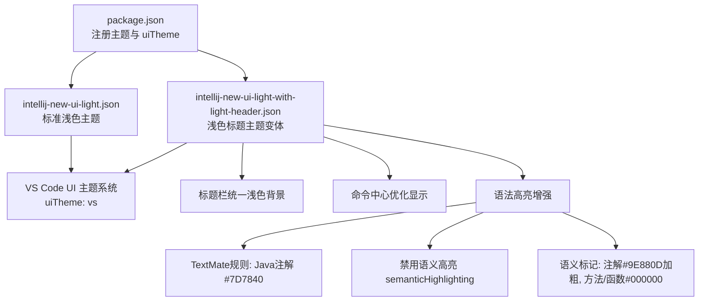
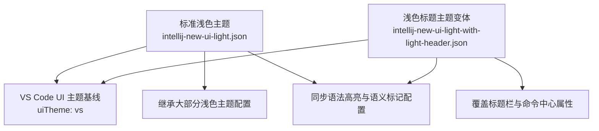

# 浅色标题主题

<cite>
**本文引用的文件**
- [themes/intellij-new-ui-light-with-light-header.json](file://themes/intellij-new-ui-light-with-light-header.json)
- [themes/intellij-new-ui-light.json](file://themes/intellij-new-ui-light.json)
- [package.json](file://package.json)
- [README.md](file://README.md)
</cite>

## 更新摘要
**变更内容**
- 更新了“简介”、“核心组件”、“架构总览”和“详细组件分析”等章节，以反映浅色标题主题在Java注解语法高亮、语义高亮控制及语义标记颜色方面的最新变更。
- 新增了关于TextMate语法高亮规则、语义高亮禁用以及`semanticTokenColors`配置的说明。
- 所有引用的文件路径和配置项均已更新为中文描述，并确保与代码变更一致。

## 目录
1. [简介](#简介)
2. [项目结构](#项目结构)
3. [核心组件](#核心组件)
4. [架构总览](#架构总览)
5. [详细组件分析](#详细组件分析)
6. [依赖关系分析](#依赖关系分析)
7. [性能考量](#性能考量)
8. [故障排查指南](#故障排查指南)
9. [结论](#结论)
10. [附录](#附录)

## 简介
本主题“浅色标题主题”（IntelliJ IDEA New UI Light with Light Header）是 VS Code 主题包中的一个变体，旨在为偏好完全浅色界面的用户提供一致、明亮且统一的视觉体验。其核心特性在于将标题栏（titleBar）的活动与非活动背景统一设置为浅色，使其与主界面背景保持一致，从而消除标题栏与内容区域之间的色彩断层。同时，该主题在 package.json 中注册为 uiTheme: 'vs'，与标准浅色主题共享同一 UI 主题类型，便于在 VS Code 的主题系统中无缝切换。

此外，该主题在命令中心（commandCenter）的显示上进行了优化，使其在浅色标题背景下依然具备良好的可读性与对比度，提升整体使用体验。

近期，该主题同步了标准浅色主题的更新，重点增强了Java语言的语法高亮支持。具体包括：新增了针对Java注解的TextMate语法高亮规则，其前景色设置为#7D7840；禁用了语义高亮（semanticHighlighting），以确保语法高亮行为的一致性；并更新了`semanticTokenColors`配置，统一了注解（annotation）的样式为前景色#9E880D并加粗，同时将方法（method）、函数（function）和属性（property）的前景色统一设置为黑色#000000，以提供更清晰的代码结构识别。

**章节来源**
- [themes/intellij-new-ui-light-with-light-header.json](file://themes/intellij-new-ui-light-with-light-header.json#L594-L604)
- [themes/intellij-new-ui-light-with-light-header.json](file://themes/intellij-new-ui-light-with-light-header.json#L741)
- [themes/intellij-new-ui-light-with-light-header.json](file://themes/intellij-new-ui-light-with-light-header.json#L742-L775)

## 项目结构
该项目采用按功能模块组织的主题文件布局：
- themes 目录包含三个主题 JSON 文件：深色主题、标准浅色主题、以及浅色标题主题变体。
- package.json 负责主题注册与贡献，声明了三个主题及其对应的 uiTheme 类型。
- README.md 提供主题概览与预览图示。


**图表来源**
- [package.json](file://package.json#L18-L36)
- [themes/intellij-new-ui-light-with-light-header.json](file://themes/intellij-new-ui-light-with-light-header.json#L1-L120)
- [themes/intellij-new-ui-light.json](file://themes/intellij-new-ui-light.json#L1-L140)

**章节来源**
- [package.json](file://package.json#L18-L36)
- [README.md](file://README.md#L1-L19)

## 核心组件
- 标题栏（titleBar）
  - 在浅色标题主题中，将 titleBar.activeBackground 与 titleBar.inactiveBackground 均设置为浅色背景值，确保标题栏与主界面背景一致，形成统一、明亮的视觉效果。
- 命令中心（commandCenter）
  - 在浅色标题主题中，保留了 commandCenter 的边框、背景与前景等关键属性，使其在浅色标题背景下仍具备清晰的层次感与可读性。
- UI 主题类型（uiTheme）
  - 在 package.json 中，该主题与标准浅色主题一样被注册为 uiTheme: 'vs'，表明它们共享相同的 VS Code UI 主题基线，便于用户在同一 UI 主题下切换不同配色方案。
- Java语法高亮与语义标记（Java Syntax Highlighting & Semantic Tokens）
  - 新增了针对Java注解的TextMate语法高亮规则（`storage.type.annotation.java`等），前景色为#7D7840。
  - 通过设置`"semanticHighlighting": false`，禁用了语义高亮功能，以优先使用TextMate规则。
  - 在`semanticTokenColors`中定义了`annotation`、`method`、`function`等语义标记的颜色，确保关键代码元素的样式统一。

**章节来源**
- [themes/intellij-new-ui-light-with-light-header.json](file://themes/intellij-new-ui-light-with-light-header.json#L81-L91)
- [themes/intellij-new-ui-light.json](file://themes/intellij-new-ui-light.json#L81-L93)
- [package.json](file://package.json#L25-L34)
- [themes/intellij-new-ui-light-with-light-header.json](file://themes/intellij-new-ui-light-with-light-header.json#L594-L604)
- [themes/intellij-new-ui-light-with-light-header.json](file://themes/intellij-new-ui-light-with-light-header.json#L741-L775)

## 架构总览
从主题注册与配置的角度看，该主题的“架构”由以下部分组成：
- 主题注册：package.json 中的 contributes.themes 列表负责将三个主题暴露给 VS Code。
- 配置继承：浅色标题主题在大多数 UI 区域沿用标准浅色主题的配色策略，仅对标题栏与命令中心的关键属性进行覆盖，以实现差异化体验。
- 视觉一致性：通过统一标题栏背景，减少界面元素间的色彩割裂，增强整体观感。
- 语法高亮策略：采用TextMate语法高亮作为主要机制，通过`tokenColors`定义Java注解等特定语法元素的颜色，并通过`semanticTokenColors`定义语义标记的颜色，同时禁用语义高亮以保证渲染一致性。



**图表来源**
- [package.json](file://package.json#L18-L36)
- [themes/intellij-new-ui-light.json](file://themes/intellij-new-ui-light.json#L1-L140)
- [themes/intellij-new-ui-light-with-light-header.json](file://themes/intellij-new-ui-light-with-light-header.json#L81-L91)
- [themes/intellij-new-ui-light-with-light-header.json](file://themes/intellij-new-ui-light-with-light-header.json#L594-L604)
- [themes/intellij-new-ui-light-with-light-header.json](file://themes/intellij-new-ui-light-with-light-header.json#L741-L775)

## 详细组件分析

### 标题栏（titleBar）设计与实现
- 设计目标
  - 将标题栏的活动与非活动背景统一为浅色，使其与编辑器、侧边栏、状态栏等主界面背景保持一致，避免视觉割裂。
- 实现方式
  - 在浅色标题主题中，明确设置 titleBar.activeBackground 与 titleBar.inactiveBackground 为浅色背景值，从而实现与主界面的无缝衔接。
- 对比参考
  - 标准浅色主题将标题栏背景设置为较深的暗色，以形成标题栏与主界面的分隔感；而浅色标题主题则反向选择，追求统一的浅色基调。


**图表来源**
- [themes/intellij-new-ui-light-with-light-header.json](file://themes/intellij-new-ui-light-with-light-header.json#L81-L84)
- [themes/intellij-new-ui-light.json](file://themes/intellij-new-ui-light.json#L81-L86)

**章节来源**
- [themes/intellij-new-ui-light-with-light-header.json](file://themes/intellij-new-ui-light-with-light-header.json#L81-L84)
- [themes/intellij-new-ui-light.json](file://themes/intellij-new-ui-light.json#L81-L86)

### 命令中心（commandCenter）显示优化
- 设计目标
  - 在浅色标题背景下，确保命令中心具备足够的对比度与可读性，避免因背景过浅导致的视觉疲劳。
- 实现方式
  - 保留并微调 commandCenter 的边框、背景与前景等关键属性，使其在浅色标题与浅色主界面的组合下依然清晰可见。
- 与标准浅色主题的对比
  - 标准浅色主题与浅色标题主题在命令中心的属性上保持一致，但浅色标题主题通过统一的标题栏背景，使命令中心的整体视觉层级更加平滑。


**图表来源**
- [themes/intellij-new-ui-light-with-light-header.json](file://themes/intellij-new-ui-light-with-light-header.json#L84-L91)
- [themes/intellij-new-ui-light.json](file://themes/intellij-new-ui-light.json#L86-L93)

**章节来源**
- [themes/intellij-new-ui-light-with-light-header.json](file://themes/intellij-new-ui-light-with-light-header.json#L84-L91)
- [themes/intellij-new-ui-light.json](file://themes/intellij-new-ui-light.json#L86-L93)

### UI 主题类型（uiTheme: 'vs'）与主题注册
- 注册机制
  - package.json 的 contributes.themes 列表将三个主题暴露给 VS Code，并指定 uiTheme: 'vs'，确保它们与 VS Code 内置的浅色 UI 主题保持一致的渲染基线。
- 变体设计目的
  - 作为标准浅色主题的替代方案，为偏好完全浅色界面的用户提供统一、明亮的视觉体验，同时保留命令中心的优化显示。


**图表来源**
- [package.json](file://package.json#L18-L36)
- [themes/intellij-new-ui-light-with-light-header.json](file://themes/intellij-new-ui-light-with-light-header.json#L1-L120)
- [themes/intellij-new-ui-light.json](file://themes/intellij-new-ui-light.json#L1-L140)

**章节来源**
- [package.json](file://package.json#L18-L36)

### Java语法高亮与语义标记配置
- 设计目标
  - 为Java代码提供更精确、更一致的语法高亮，特别是对注解（@Override, @Component等）进行突出显示，并统一方法、函数等关键元素的样式。
- 实现方式
  - **TextMate语法高亮**: 在`tokenColors`中新增了针对Java注解的规则，其`scope`包含`storage.type.annotation.java`等，`settings.foreground`设置为#7D7840。
  - **禁用语义高亮**: 设置`"semanticHighlighting": false`，强制VS Code使用TextMate规则而非语言服务器提供的语义信息进行高亮，确保主题的独立性和一致性。
  - **语义标记颜色**: 在`semanticTokenColors`中定义了`annotation`、`method`、`function`等标记的颜色。例如，`annotation`的前景色为#9E880D并加粗，`method`和`function`的前景色为#000000。
- 与标准浅色主题的对比
  - 此配置与标准浅色主题（intellij-new-ui-light.json）完全同步，确保了两个主题在代码编辑区域的视觉体验完全一致。

```json
// 示例代码：Java注解的TextMate语法高亮规则
{
  "name": "Java Annotations",
  "scope": [
    "storage.type.annotation.java",
    "punctuation.definition.annotation.java",
    "variable.annotation.java",
    "meta.declaration.annotation.java"
  ],
  "settings": {
    "foreground": "#7D7840"
  }
}
```

```json
// 示例代码：语义标记颜色配置
"semanticHighlighting": false,
"semanticTokenColors": {
  "annotation": {
    "foreground": "#9E880D",
    "bold": true
  },
  "method": {
    "foreground": "#000000"
  },
  "function": {
    "foreground": "#000000"
  }
}
```

**章节来源**
- [themes/intellij-new-ui-light-with-light-header.json](file://themes/intellij-new-ui-light-with-light-header.json#L594-L604)
- [themes/intellij-new-ui-light-with-light-header.json](file://themes/intellij-new-ui-light-with-light-header.json#L741-L775)
- [themes/intellij-new-ui-light.json](file://themes/intellij-new-ui-light.json#L596-L606)
- [themes/intellij-new-ui-light.json](file://themes/intellij-new-ui-light.json#L743-L778)

## 依赖关系分析
- 主题间依赖
  - 浅色标题主题在大多数 UI 区域沿用标准浅色主题的配色策略，仅对标题栏与命令中心的关键属性进行覆盖，体现了“继承 + 覆盖”的设计模式。
- 外部依赖
  - 通过 package.json 的 uiTheme: 'vs'，与 VS Code 的浅色 UI 主题基线保持一致，确保渲染行为与内置主题兼容。
  - 语法高亮配置（`tokenColors`和`semanticTokenColors`）直接依赖于VS Code的文本编辑器语法高亮系统。



**图表来源**
- [themes/intellij-new-ui-light.json](file://themes/intellij-new-ui-light.json#L1-L140)
- [themes/intellij-new-ui-light-with-light-header.json](file://themes/intellij-new-ui-light-with-light-header.json#L1-L120)
- [package.json](file://package.json#L25-L34)

**章节来源**
- [themes/intellij-new-ui-light.json](file://themes/intellij-new-ui-light.json#L1-L140)
- [themes/intellij-new-ui-light-with-light-header.json](file://themes/intellij-new-ui-light-with-light-header.json#L1-L120)
- [package.json](file://package.json#L25-L34)

## 性能考量
- 主题体积与加载
  - 该主题为纯 JSON 配置，不包含额外资源，加载开销极低，切换主题时几乎无感知延迟。
- 渲染一致性
  - 统一的浅色背景减少了颜色过渡与阴影的复杂度，有助于在低端设备上保持流畅渲染。
- 语法高亮性能
  - 禁用`semanticHighlighting`可以减少与语言服务器的通信开销，对于大型项目可能带来轻微的性能提升，同时确保了高亮样式的绝对一致性。

## 故障排查指南
- 主题未出现在主题列表中
  - 检查 package.json 的 contributes.themes 是否正确声明了主题标签、uiTheme 与路径。
- 标题栏颜色不符合预期
  - 确认浅色标题主题中 titleBar.activeBackground 与 titleBar.inactiveBackground 已设置为浅色背景值。
- 命令中心显示不清晰
  - 检查 commandCenter 的边框、背景与前景属性是否按需调整，确保在浅色背景下具备足够对比度。
- Java注解颜色未生效
  - 检查`tokenColors`中是否包含正确的`scope`规则，并确认`semanticHighlighting`已设置为`false`。
- 方法或函数颜色异常
  - 检查`semanticTokenColors`中`method`和`function`的配置是否正确，确保其前景色为#000000。

**章节来源**
- [package.json](file://package.json#L18-L36)
- [themes/intellij-new-ui-light-with-light-header.json](file://themes/intellij-new-ui-light-with-light-header.json#L81-L91)
- [themes/intellij-new-ui-light-with-light-header.json](file://themes/intellij-new-ui-light-with-light-header.json#L594-L604)
- [themes/intellij-new-ui-light-with-light-header.json](file://themes/intellij-new-ui-light-with-light-header.json#L741-L775)

## 结论
浅色标题主题通过将标题栏背景统一为浅色，显著提升了界面的统一性与明亮度，同时在命令中心的显示上保持了良好的对比度与可读性。它与标准浅色主题共享 uiTheme: 'vs'，并在大多数 UI 区域继承相同配色策略，仅对标题栏与命令中心进行必要覆盖，从而为偏好完全浅色界面的用户提供了一个既统一又优化的替代方案。

更重要的是，该主题现已同步了最新的语法高亮改进。通过新增Java注解的TextMate高亮规则、禁用语义高亮以及统一`semanticTokenColors`中的关键样式，确保了代码编辑区域的视觉体验更加精确、一致和专业，特别优化了Java开发环境的观感。

## 附录
- 使用建议
  - 若你偏好统一的浅色界面，建议优先尝试浅色标题主题；若更喜欢标题栏与主界面的明暗分隔，可继续使用标准浅色主题。
- 参考文件
  - 三个主题文件与 package.json 的具体配置位置见“章节来源”。