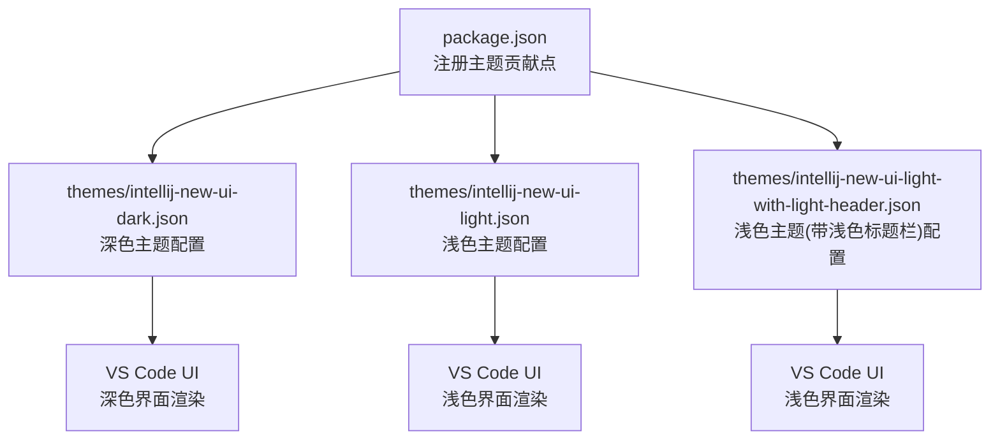
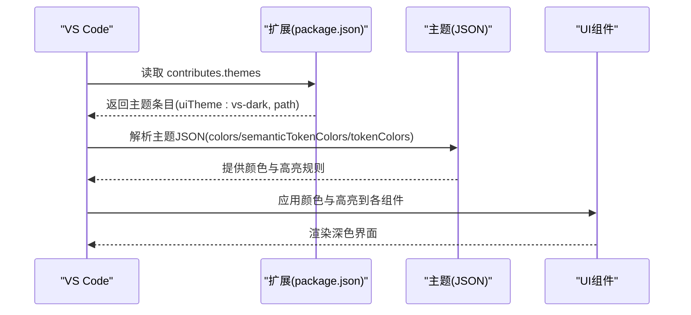
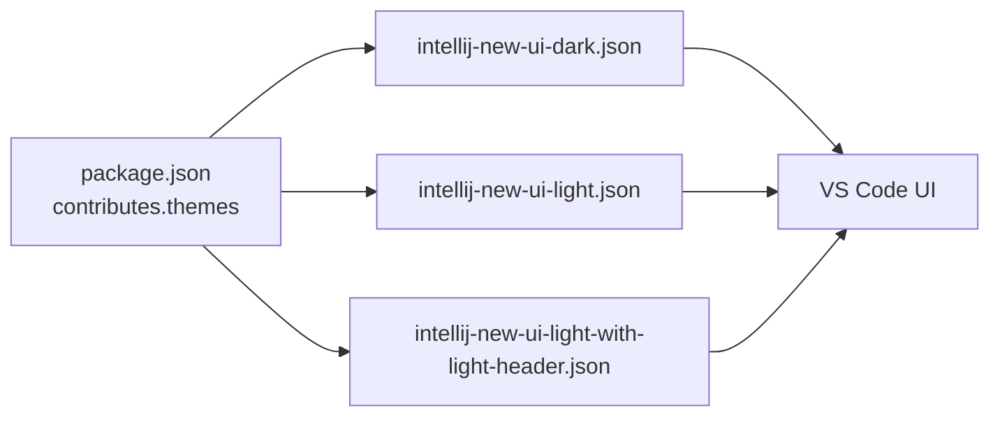

# 深色主题

<cite>
**本文引用的文件**
- [themes/intellij-new-ui-dark.json](file://themes/intellij-new-ui-dark.json)
- [package.json](file://package.json)
- [themes/intellij-new-ui-light.json](file://themes/intellij-new-ui-light.json)
- [themes/intellij-new-ui-light-with-light-header.json](file://themes/intellij-new-ui-light-with-light-header.json)
- [README.md](file://README.md)
- [CHANGELOG.md](file://CHANGELOG.md)
- [LICENSE.txt](file://LICENSE.txt)
</cite>

## 目录
1. [简介](#简介)
2. [项目结构](#项目结构)
3. [核心组件](#核心组件)
4. [架构总览](#架构总览)
5. [详细组件分析](#详细组件分析)
6. [依赖关系分析](#依赖关系分析)
7. [性能考量](#性能考量)
8. [故障排查指南](#故障排查指南)
9. [结论](#结论)
10. [附录](#附录)

## 简介
本文档聚焦于深色主题配置文件 themes/intellij-new-ui-dark.json 的实现与使用方式，深入解析其作为基于 IntelliJ IDEA 2025.1.2 的“IntelliJ IDEA New UI Dark”主题的配置结构。文档详细阐述了 colors 对象中定义的深色系 UI 元素颜色（例如 titleBar.activeBackground: #2b2d30、sideBar.background: #2b2d30、editor.background: #1e1f22），以及 tokenColors 数组中定义的语法高亮规则。同时说明该主题通过 package.json 中的 uiTheme: 'vs-dark' 进行注册，使其适配 VS Code 的深色界面。文档提供关键配置项的实际代码示例，如列表选中项(list.activeSelectionBackground)、按钮(button.background)和状态栏(statusBar.background)的颜色设置。重点解释了语义高亮(semanticHighlighting: true)如何通过区分注解、方法声明与调用等规则来增强代码可读性，并对比其与浅色主题在视觉层次和用户体验上的差异。内容兼顾初学者对主题结构的理解和高级用户对自定义配置的参考需求。

## 项目结构
该项目为 VS Code 主题包，包含三个主题 JSON 文件：深色主题、浅色主题与“带浅色标题栏”的浅色主题。主题通过 package.json 的 contributes.themes 注册，其中深色主题以 uiTheme: 'vs-dark' 标识，指向 themes/intellij-new-ui-dark.json。

**图表来源**
- [package.json](file://package.json#L18-L36)
- [themes/intellij-new-ui-dark.json](file://themes/intellij-new-ui-dark.json#L1-L20)
- [themes/intellij-new-ui-light.json](file://themes/intellij-new-ui-light.json#L1-L20)
- [themes/intellij-new-ui-light-with-light-header.json](file://themes/intellij-new-ui-light-with-light-header.json#L1-L20)

**章节来源**
- [package.json](file://package.json#L18-L36)
- [README.md](file://README.md#L1-L19)

## 核心组件
- **主题类型与基础属性**
  - 类型：深色主题，type 字段为 "dark"
  - 语义高亮：semanticHighlighting 设为 true，启用语义令牌高亮
  - 语义令牌颜色映射：semanticTokenColors 定义命名空间、变量、参数、类型、接口、类、属性等的前景色与字体样式
- **颜色体系（colors）**
  - 标题栏：titleBar.activeBackground、titleBar.inactiveBackground
  - 菜单栏与快速输入：menubar.*、quickInputList.focusBackground
  - 列表交互：list.activeSelectionBackground、list.hoverBackground、list.inactiveSelectionBackground 等
  - 侧边栏：sideBar.background、sideBar.foreground、sideBarSectionHeader.*
  - 输入控件：input.*、dropdown.*、button.*、badge.*
  - Git 装饰：gitDecoration.*，其中 gitDecoration.ignoredResourceForeground 颜色已从 #848504 微调为 #6f737a
  - 面板与终端：panel.*、terminal.*
  - 下拉框与通知：dropdown.*、notification*
  - 编辑器区域：editorGroup.*、tab.*、breadcrumb.*、scrollbarSlider.*、editor.*、editorWidget.*、editorSuggestWidget.*、editorHoverWidget.*、editorOverviewRuler.*、minimap.*、diffEditor.*、peekView.*、merge.*、settings.*、welcomePage.*
  - 状态栏：statusBar.*、statusBarItem.*
- **语法高亮（tokenColors）**
  - 大幅扩展和重组，新增了标点符号、存储类型、类引用和 Java 特定的方法调用与声明规则
- **与浅色主题对比**
  - 浅色主题 colors 中大量使用明亮背景与较深前景色，强调对比度与可读性
  - 深色主题 colors 多采用深灰/近黑背景与中性/暖色前景，降低屏幕亮度，减少眩光

**章节来源**
- [themes/intellij-new-ui-dark.json](file://themes/intellij-new-ui-dark.json#L1-L286)
- [themes/intellij-new-ui-light.json](file://themes/intellij-new-ui-light.json#L1-L140)
- [themes/intellij-new-ui-light-with-light-header.json](file://themes/intellij-new-ui-light-with-light-header.json#L1-L138)

## 架构总览
深色主题的生效流程：
- VS Code 打开扩展后，读取 package.json 的 contributes.themes
- 根据 uiTheme: 'vs-dark' 选择对应主题文件
- 加载 themes/intellij-new-ui-dark.json 的 colors、semanticTokenColors、tokenColors
- 在编辑器与 UI 组件中应用颜色与高亮规则

**图表来源**
- [package.json](file://package.json#L18-L36)
- [themes/intellij-new-ui-dark.json](file://themes/intellij-new-ui-dark.json#L1-L286)

## 详细组件分析

### 深色主题配置结构概览
- **主题元信息**
  - $schema：指向 VS Code 颜色主题模式
  - type："dark"
  - semanticHighlighting：true
- **colors**：覆盖标题栏、菜单、命令中心、快速输入、列表、活动栏、输入、按钮、徽章、Git 装饰、面板、终端、下拉框、通知、编辑器组、标签页、面包屑、滚动条、调试图标、编辑器、编辑器小部件、编辑器概览标尺、Minimap、Diff 编辑器、预览视图、合并编辑器、设置页、欢迎页等 UI 组件的颜色
- **semanticTokenColors**：为命名空间、变量、参数、类型、接口、类、属性等提供语义高亮的前景色与字体样式，并新增了对注解（annotation）、修饰符（modifier.annotation）、类型注解（type.annotation）的专门规则
- **tokenColors**：为注释、关键字、存储、常量、字符串、正则、支持类型、实体名、属性、运算符、Punctuation、链接、Markdown 样式等提供基于作用域的语法高亮，已大幅扩展和重组

**章节来源**
- [themes/intellij-new-ui-dark.json](file://themes/intellij-new-ui-dark.json#L1-L286)

### 关键配置项与实际代码示例路径
以下为常见 UI 组件的关键颜色配置项及其在深色主题中的位置路径（以“文件路径#行号范围”形式给出，不直接展示代码内容）：
- **列表选中项**
  - list.activeSelectionBackground：[themes/intellij-new-ui-dark.json#L51-L51]
  - list.hoverBackground：[themes/intellij-new-ui-dark.json#L58-L58]
  - list.inactiveSelectionBackground：[themes/intellij-new-ui-dark.json#L56-L56]
- **按钮**
  - button.background：[themes/intellij-new-ui-dark.json#L87-L87]
  - button.hoverBackground：[themes/intellij-new-ui-dark.json#L90-L90]
  - button.secondaryBackground：[themes/intellij-new-ui-dark.json#L91-L91]
- **状态栏**
  - statusBar.background：[themes/intellij-new-ui-dark.json#L127-L127]
  - statusBarItem.activeBackground：[themes/intellij-new-ui-dark.json#L136-L136]
  - statusBarItem.errorBackground：[themes/intellij-new-ui-dark.json#L137-L137]
  - statusBarItem.warningBackground：[themes/intellij-new-ui-dark.json#L139-L139]
- **编辑器背景**
  - editor.background：[themes/intellij-new-ui-dark.json#L192-L192]
- **侧边栏背景**
  - sideBar.background：[themes/intellij-new-ui-dark.json#L73-L73]
- **标题栏背景**
  - titleBar.activeBackground：[themes/intellij-new-ui-dark.json#L33-L33]
  - titleBar.inactiveBackground：[themes/intellij-new-ui-dark.json#L34-L34]
- **Git 装饰**
  - gitDecoration.addedResourceForeground：[themes/intellij-new-ui-dark.json#L98-L98]
  - gitDecoration.modifiedResourceForeground：[themes/intellij-new-ui-dark.json#L99-L99]
  - gitDecoration.deletedResourceForeground：[themes/intellij-new-ui-dark.json#L100-L100]
  - gitDecoration.ignoredResourceForeground：[themes/intellij-new-ui-dark.json#L105-L105] (已从 #848504 微调为 #6f737a)
- **面板与终端**
  - panel.background：[themes/intellij-new-ui-dark.json#L108-L108]
  - terminal.background：[themes/intellij-new-ui-dark.json#L114-L114]
- **下拉框与通知**
  - dropdown.background：[themes/intellij-new-ui-dark.json#L119-L119]
  - notifications.background：[themes/intellij-new-ui-dark.json#L146-L146]
- **编辑器组与标签页**
  - editorGroupHeader.tabsBackground：[themes/intellij-new-ui-dark.json#L156-L156]
  - tab.activeBackground：[themes/intellij-new-ui-dark.json#L161-L161]
  - tab.activeBorder：[themes/intellij-new-ui-dark.json#L163-L163]
  - tab.hoverBackground：[themes/intellij-new-ui-dark.json#L166-L166]
- **面包屑**
  - breadcrumb.background：[themes/intellij-new-ui-dark.json#L181-L181]
  - breadcrumb.activeSelectionForeground：[themes/intellij-new-ui-dark.json#L183-L183]
- **滚动条**
  - scrollbarSlider.activeBackground：[themes/intellij-new-ui-dark.json#L186-L186]
  - scrollbarSlider.background：[themes/intellij-new-ui-dark.json#L187-L187]
  - scrollbarSlider.hoverBackground：[themes/intellij-new-ui-dark.json#L188-L188]
- **编辑器内联提示**
  - editorInlayHint.foreground：[themes/intellij-new-ui-dark.json#L206-L206]
  - editorInlayHint.typeBackground：[themes/intellij-new-ui-dark.json#L207-L207]
  - editorInlayHint.parameterBackground：[themes/intellij-new-ui-dark.json#L208-L208]
- **Minimap**
  - minimapSlider.background：[themes/intellij-new-ui-dark.json#L254-L254]
  - minimapSlider.hoverBackground：[themes/intellij-new-ui-dark.json#L255-L255]
  - minimapSlider.activeBackground：[themes/intellij-new-ui-dark.json#L256-L256]
- **Diff 编辑器**
  - diffEditor.insertedTextBackground：[themes/intellij-new-ui-dark.json#L261-L261]
  - diffEditor.removedTextBackground：[themes/intellij-new-ui-dark.json#L264-L264]
- **预览视图**
  - peekViewEditor.background：[themes/intellij-new-ui-dark.json#L271-L271]
  - peekViewResult.selectionBackground：[themes/intellij-new-ui-dark.json#L278-L278]
- **合并编辑器**
  - mergeEditor.change.background：[themes/intellij-new-ui-dark.json#L289-L289]
  - mergeEditor.change.word.background：[themes/intellij-new-ui-dark.json#L290-L290]
- **设置页**
  - settings.dropdownBackground：[themes/intellij-new-ui-dark.json#L296-L296]
  - settings.checkboxBackground：[themes/intellij-new-ui-dark.json#L299-L299]
  - settings.numberInputBackground：[themes/intellij-new-ui-dark.json#L302-L302]
  - settings.textInputBackground：[themes/intellij-new-ui-dark.json#L305-L305]
- **欢迎页**
  - welcomePage.background：[themes/intellij-new-ui-dark.json#L309-L309]
  - welcomePage.tileBackground：[themes/intellij-new-ui-dark.json#L310-L310]
  - welcomePage.tileHoverBackground：[themes/intellij-new-ui-dark.json#L311-L311]

**章节来源**
- [themes/intellij-new-ui-dark.json](file://themes/intellij-new-ui-dark.json#L1-L286)

### 语法高亮规则（tokenColors）
深色主题的 tokenColors 经过大幅扩展和重组，覆盖了注释、块注释、文档注释、关键字、存储、常量、字符串、正则、支持类型、实体名、属性、运算符、Punctuation、链接、Markdown 样式等作用域，并为部分作用域设置了字体样式（如斜体、下划线、粗体）。新增了对 Punctuation（标点符号）的专门规则，并为 Java 语言新增了特定的方法调用与声明规则。这些规则与 colors 中的编辑器前景色、背景色共同构成完整的代码可读性体系。

**章节来源**
- [themes/intellij-new-ui-dark.json](file://themes/intellij-new-ui-dark.json#L434-L916)

### 语义高亮（semanticHighlighting）
- **开启方式**：在主题根级设置 semanticHighlighting: true
- **作用**：根据语言解析器提供的语义信息，为命名空间、变量、参数、类型、接口、类、属性等提供更精准的高亮，避免仅依赖词法分析导致的误判
- **在深色主题中**，semanticTokenColors 为各类语义令牌指定前景色与字体样式，使复杂代码结构在深色背景下仍保持清晰层次。系统显著增强了语义高亮，新增了对注解（annotation）、修饰符（modifier.annotation）、类型注解（type.annotation）的专门规则，并精确区分了方法声明（蓝色）和方法调用（白色）。

**章节来源**
- [themes/intellij-new-ui-dark.json](file://themes/intellij-new-ui-dark.json#L313-L433)

### 与浅色主题的视觉层次与体验差异
- **背景与前景**
  - 深色主题：编辑器背景、侧边栏背景、面板背景等多处采用深灰/近黑，减少屏幕亮度，适合低光照环境
  - 浅色主题：编辑器背景、侧边栏背景、面板背景等采用白色或浅灰，强调明亮与对比度
- **选中与悬停**
  - 深色主题：list.activeSelectionBackground、statusBarItem.activeBackground 使用相对饱和的蓝色调，突出当前焦点
  - 浅色主题：list.activeSelectionBackground 使用浅蓝/浅灰，同样强调当前焦点但视觉上更柔和
- **编辑器高亮**
  - 深色主题：editor.selectionBackground、editor.findMatchBackground 使用较深的蓝色调，与背景形成良好对比
  - 浅色主题：editor.selectionBackground 使用浅蓝，editor.findMatchBackground 使用浅黄/浅橙，强调搜索命中
- **Git 装饰**
  - 深色主题：gitDecoration.addedResourceForeground、gitDecoration.modifiedResourceForeground 等使用暖色/冷色区分增删改，便于快速识别
  - 浅色主题：同样使用不同颜色区分，但整体对比度更高
- **可读性与疲劳度**
  - 深色主题在长时间编码时可降低眩光，减少眼部疲劳，但需要确保足够的对比度以保证可读性
  - 浅色主题在明亮环境下更易读，但在暗室或强光下可能产生眩光

**章节来源**
- [themes/intellij-new-ui-dark.json](file://themes/intellij-new-ui-dark.json#L1-L286)
- [themes/intellij-new-ui-light.json](file://themes/intellij-new-ui-light.json#L1-L140)
- [themes/intellij-new-ui-light-with-light-header.json](file://themes/intellij-new-ui-light-with-light-header.json#L1-L138)

## 依赖关系分析
- **主题注册**
  - package.json 的 contributes.themes 中，uiTheme: 'vs-dark' 指向 themes/intellij-new-ui-dark.json
- **主题加载**
  - VS Code 在启动或切换主题时，读取对应 JSON 并应用 colors、semanticTokenColors、tokenColors
- **与其他主题的关系**
  - 浅色主题与“带浅色标题栏”的浅色主题共享相同的 UI 结构，但颜色值不同，用于满足不同偏好

**图表来源**
- [package.json](file://package.json#L18-L36)
- [themes/intellij-new-ui-dark.json](file://themes/intellij-new-ui-dark.json#L1-L20)
- [themes/intellij-new-ui-light.json](file://themes/intellij-new-ui-light.json#L1-L20)
- [themes/intellij-new-ui-light-with-light-header.json](file://themes/intellij-new-ui-light-with-light-header.json#L1-L20)

**章节来源**
- [package.json](file://package.json#L18-L36)

## 性能考量
- **主题体积与加载**
  - 深色主题 JSON 包含大量颜色与高亮规则，建议保持合理的层级与命名，避免重复定义
- **渲染性能**
  - 语义高亮依赖语言服务的解析结果，首次打开大型项目时可能有轻微延迟
  - 合理设置 tokenColors 与 semanticTokenColors，避免过度复杂的样式组合
- **可维护性**
  - 将相似 UI 组件的颜色分组管理（如列表、编辑器、面板等），便于后续调整与一致性维护

## 故障排查指南
- **主题未生效**
  - 检查 package.json 的 contributes.themes 是否正确声明 uiTheme: 'vs-dark' 且 path 指向正确的 JSON 文件
  - 确认 VS Code 版本满足 engines 字段要求
- **颜色显示异常**
  - 检查 colors 中是否存在拼写错误或缺失的键
  - 若某些 UI 组件颜色未按预期，确认是否被其他主题或扩展覆盖
- **语法高亮不准确**
  - 确认 semanticHighlighting 已开启
  - 检查 semanticTokenColors 是否覆盖目标语言的语义令牌类型
  - 更新语言服务器或插件以获得更准确的语义信息
- **与浅色主题对比**
  - 若希望对比差异，可在 VS Code 中切换主题，观察 colors 与 tokenColors 的视觉效果变化

**章节来源**
- [package.json](file://package.json#L8-L10)
- [themes/intellij-new-ui-dark.json](file://themes/intellij-new-ui-dark.json#L1-L286)
- [themes/intellij-new-ui-light.json](file://themes/intellij-new-ui-light.json#L1-L140)
- [themes/intellij-new-ui-light-with-light-header.json](file://themes/intellij-new-ui-light-with-light-header.json#L1-L138)

## 结论
深色主题通过系统化的 colors、semanticTokenColors 与 tokenColors 实现了从 UI 组件到语法高亮的完整视觉体系。其以深色背景为主基调，结合语义高亮与精心设计的色彩搭配，在降低眩光的同时保持良好的可读性与层次感。通过 package.json 的 uiTheme: 'vs-dark' 注册，该主题无缝适配 VS Code 的深色界面。对于初学者，理解 colors 与 tokenColors 的组织方式即可快速上手；对于高级用户，可通过调整语义令牌颜色与作用域规则进一步定制个性化开发体验。本次更新全面重构了主题，正式引入基于 IntelliJ IDEA 2025.1.2 的“IntelliJ IDEA New UI Dark”主题，增强了语义高亮系统，并微调了 Git 装饰颜色以提升视觉和谐度。

## 附录
- **版本与发布记录**
  - 参见 CHANGELOG.md，了解版本变更与初始发布信息
- **许可证**
  - 项目采用 MIT 许可证，允许自由使用与修改
- **获取与预览**
  - README.md 提供了主题截图与下载入口，便于直观了解视觉效果

**章节来源**
- [CHANGELOG.md](file://CHANGELOG.md#L1-L14)
- [LICENSE.txt](file://LICENSE.txt#L1-L23)
- [README.md](file://README.md#L1-L19)