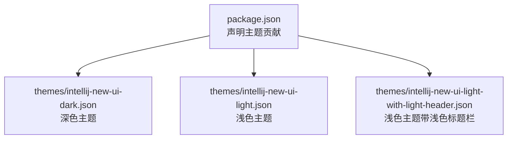
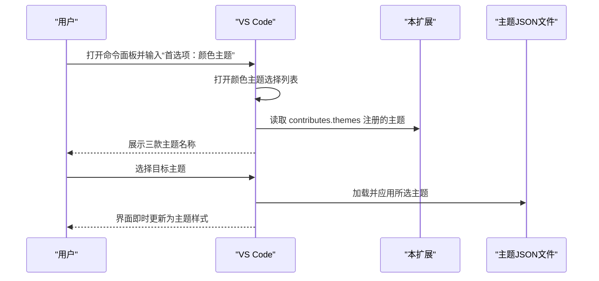
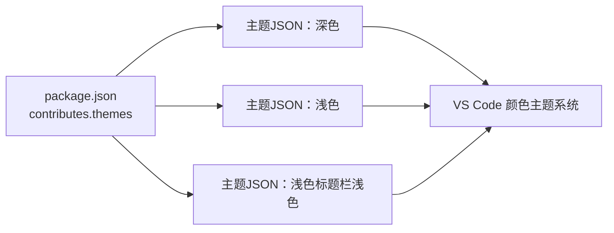

# 使用方法

<cite>
**本文引用的文件**
- [README.md](file://README.md)
- [package.json](file://package.json)
- [themes/intellij-new-ui-dark.json](file://themes/intellij-new-ui-dark.json)
- [themes/intellij-new-ui-light.json](file://themes/intellij-new-ui-light.json)
- [themes/intellij-new-ui-light-with-light-header.json](file://themes/intellij-new-ui-light-with-light-header.json)
</cite>

## 目录
1. [简介](#简介)
2. [项目结构](#项目结构)
3. [核心组件](#核心组件)
4. [架构总览](#架构总览)
5. [详细组件分析](#详细组件分析)
6. [依赖关系分析](#依赖关系分析)
7. [性能注意事项](#性能注意事项)
8. [故障排查指南](#故障排查指南)
9. [结论](#结论)
10. [附录](#附录)

## 简介
本扩展旨在为 VS Code 带来 IntelliJ IDEA 新界面风格的主题体验，提供三款主题：深色主题、浅色主题、以及带浅色标题栏的浅色主题。安装完成后，您可以通过命令面板快速切换主题，无需重启编辑器即可即时生效；同时可结合工作区设置为特定项目锁定主题，或通过 settings.json 设置默认主题，从而在不同光照环境下灵活切换。

## 项目结构
该仓库采用“主题贡献 + 颜色主题文件”的组织方式：
- package.json 中声明了三个颜色主题的贡献项，分别对应三款主题文件
- themes 目录下包含三款 JSON 主题文件，分别定义了深色与两种浅色风格的颜色映射与语义高亮

图表来源
- [package.json](file://package.json#L18-L36)
- [themes/intellij-new-ui-dark.json](file://themes/intellij-new-ui-dark.json#L1-L20)
- [themes/intellij-new-ui-light.json](file://themes/intellij-new-ui-light.json#L1-L20)
- [themes/intellij-new-ui-light-with-light-header.json](file://themes/intellij-new-ui-light-with-light-header.json#L1-L20)

章节来源
- [package.json](file://package.json#L18-L36)

## 核心组件
- 主题贡献注册：通过 package.json 的 contributes.themes 数组注册三款主题，包括标签名、UI 主题类型（vs-dark 或 vs）、以及对应的主题 JSON 路径
- 主题文件：三款主题 JSON 文件分别定义了编辑器、侧边栏、活动栏、状态栏、终端、Git 装饰等 UI 组件的颜色与语义高亮规则

章节来源
- [package.json](file://package.json#L18-L36)
- [themes/intellij-new-ui-dark.json](file://themes/intellij-new-ui-dark.json#L1-L40)
- [themes/intellij-new-ui-light.json](file://themes/intellij-new-ui-light.json#L1-L40)
- [themes/intellij-new-ui-light-with-light-header.json](file://themes/intellij-new-ui-light-with-light-header.json#L1-L40)

## 架构总览
从 VS Code 视角看，主题加载与切换流程如下：
- 安装扩展后，VS Code 读取 package.json 的主题贡献，将三款主题显示在“首选项：颜色主题”列表中
- 用户在命令面板执行“首选项：颜色主题”命令后，打开主题选择列表
- 在列表中选择目标主题，VS Code 即刻应用主题，无需重启

图表来源
- [package.json](file://package.json#L18-L36)
- [themes/intellij-new-ui-dark.json](file://themes/intellij-new-ui-dark.json#L1-L20)
- [themes/intellij-new-ui-light.json](file://themes/intellij-new-ui-light.json#L1-L20)
- [themes/intellij-new-ui-light-with-light-header.json](file://themes/intellij-new-ui-light-with-light-header.json#L1-L20)

## 详细组件分析

### 通过命令面板切换主题的完整流程
- 步骤一：打开命令面板
  - 快捷键：Windows/Linux: Ctrl+Shift+P；macOS: Cmd+Shift+P
  - 或通过菜单“视图 > 命令面板”
- 步骤二：输入并选择命令
  - 输入“首选项：颜色主题”，回车
  - 在弹出的主题列表中，找到以下三项之一：
    - IntelliJ IDEA New UI Dark
    - IntelliJ IDEA New UI Light
    - IntelliJ IDEA New UI Light with Light Header
- 步骤三：即时生效
  - 选择后界面立即切换为主题样式，无需重启编辑器

提示
- 切换主题时，VS Code 会根据主题 JSON 文件中的颜色映射即时刷新 UI 组件外观
- 若未看到上述三项，请确认已安装本扩展且版本匹配 VS Code 引擎要求

章节来源
- [README.md](file://README.md#L1-L19)
- [package.json](file://package.json#L18-L36)

### 在不同光照条件下快速切换主题
- 深色主题适合夜间或暗光环境，减少屏幕眩光
- 浅色主题适合明亮环境，提升可读性
- 带浅色标题栏的浅色主题在明亮环境下可进一步降低标题栏对比度，减轻视觉压力
- 建议根据一天中的光照变化，在三者之间快速切换，以获得更舒适的编码体验

章节来源
- [themes/intellij-new-ui-dark.json](file://themes/intellij-new-ui-dark.json#L1-L40)
- [themes/intellij-new-ui-light.json](file://themes/intellij-new-ui-light.json#L1-L40)
- [themes/intellij-new-ui-light-with-light-header.json](file://themes/intellij-new-ui-light-with-light-header.json#L1-L40)

### 高级使用技巧

- 设置默认主题（settings.json）
  - 在用户设置中添加默认颜色主题键值，使新窗口或新会话默认应用指定主题
  - 可选值为三款主题的标签名之一
  - 应用后即时生效，无需重启

- 为特定项目锁定主题（工作区设置）
  - 在项目根目录创建 .vscode/settings.json
  - 添加默认颜色主题键值，仅影响当前工作区
  - 团队成员打开同一项目时将自动应用该主题，便于统一开发体验

- 主题与图标主题、文件图标插件的兼容性
  - 本扩展专注于颜色主题，不包含图标主题或文件图标插件
  - 如需完整的 IntelliJ 体验，建议配合官方图标主题与文件图标插件使用，以获得一致的视觉风格
  - 若发现图标或文件图标与主题存在对比度或风格差异，可在扩展市场搜索并安装 JetBrains 官方图标主题或社区推荐的文件图标包

章节来源
- [package.json](file://package.json#L18-L36)
- [themes/intellij-new-ui-dark.json](file://themes/intellij-new-ui-dark.json#L1-L40)
- [themes/intellij-new-ui-light.json](file://themes/intellij-new-ui-light.json#L1-L40)
- [themes/intellij-new-ui-light-with-light-header.json](file://themes/intellij-new-ui-light-with-light-header.json#L1-L40)

### 主题切换的即时生效特性
- VS Code 在用户选择主题后，会立即加载对应主题 JSON 并刷新 UI
- 不需要重启编辑器，也不需要重新加载窗口
- 若切换后未见效果，可尝试重新选择同一主题以强制刷新

章节来源
- [package.json](file://package.json#L18-L36)

## 依赖关系分析
- 主题注册依赖于 VS Code 的主题贡献机制
- 主题文件依赖于 VS Code 的颜色主题 schema 与语义令牌高亮系统
- 与图标主题、文件图标插件无直接耦合，但可共同构建完整的 IDE 外观

图表来源
- [package.json](file://package.json#L18-L36)
- [themes/intellij-new-ui-dark.json](file://themes/intellij-new-ui-dark.json#L1-L20)
- [themes/intellij-new-ui-light.json](file://themes/intellij-new-ui-light.json#L1-L20)
- [themes/intellij-new-ui-light-with-light-header.json](file://themes/intellij-new-ui-light-with-light-header.json#L1-L20)

章节来源
- [package.json](file://package.json#L18-L36)

## 性能注意事项
- 主题切换为即时生效，不会引入额外的启动延迟
- 若同时启用大量扩展（尤其是图标主题），建议关注整体 UI 渲染性能
- 在低配设备上，建议优先使用轻量图标主题或关闭不必要的预览功能

## 故障排查指南
- 未在主题列表中看到本扩展提供的主题
  - 确认已安装本扩展且版本满足引擎要求
  - 重启 VS Code 后再次尝试
- 切换主题后界面未更新
  - 尝试重新选择同一主题以强制刷新
  - 检查是否存在工作区设置覆盖了用户设置
- 图标或文件图标与主题风格不一致
  - 安装 JetBrains 官方图标主题或社区推荐的文件图标插件
  - 调整对比度或亮度以改善阅读体验

章节来源
- [package.json](file://package.json#L1-L17)
- [themes/intellij-new-ui-dark.json](file://themes/intellij-new-ui-dark.json#L1-L40)
- [themes/intellij-new-ui-light.json](file://themes/intellij-new-ui-light.json#L1-L40)
- [themes/intellij-new-ui-light-with-light-header.json](file://themes/intellij-new-ui-light-with-light-header.json#L1-L40)

## 结论
通过本扩展，您可以轻松在 VS Code 中应用 IntelliJ IDEA 新界面风格的主题。只需在命令面板中选择“首选项：颜色主题”，即可在三款主题间即时切换；并通过用户或工作区设置锁定默认主题，满足不同光照环境下的使用需求。若希望获得更完整的 IntelliJ 体验，建议搭配官方图标主题与文件图标插件使用。

## 附录
- 下载与安装
  - 可通过 VS Code 市场或 Open-VSX 注册表获取本扩展
- 主题文件概览
  - 深色主题：适用于夜间或暗光环境
  - 浅色主题：适用于明亮环境
  - 浅色主题（带浅色标题栏）：在明亮环境下进一步降低标题栏对比度

章节来源
- [README.md](file://README.md#L14-L19)
- [package.json](file://package.json#L18-L36)