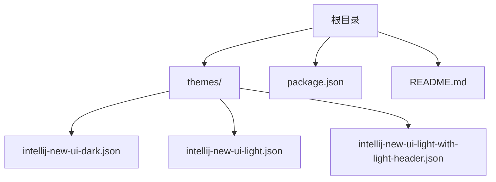
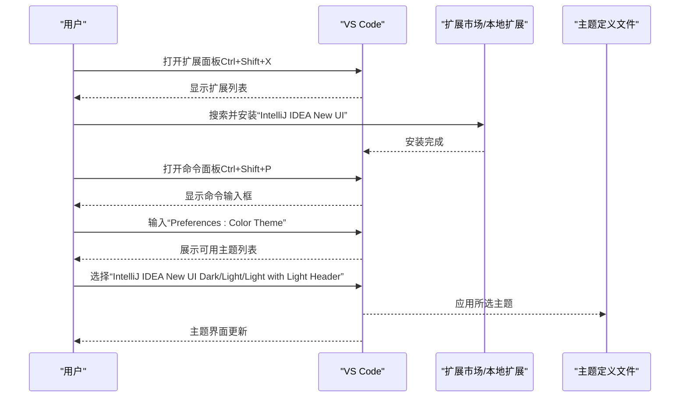
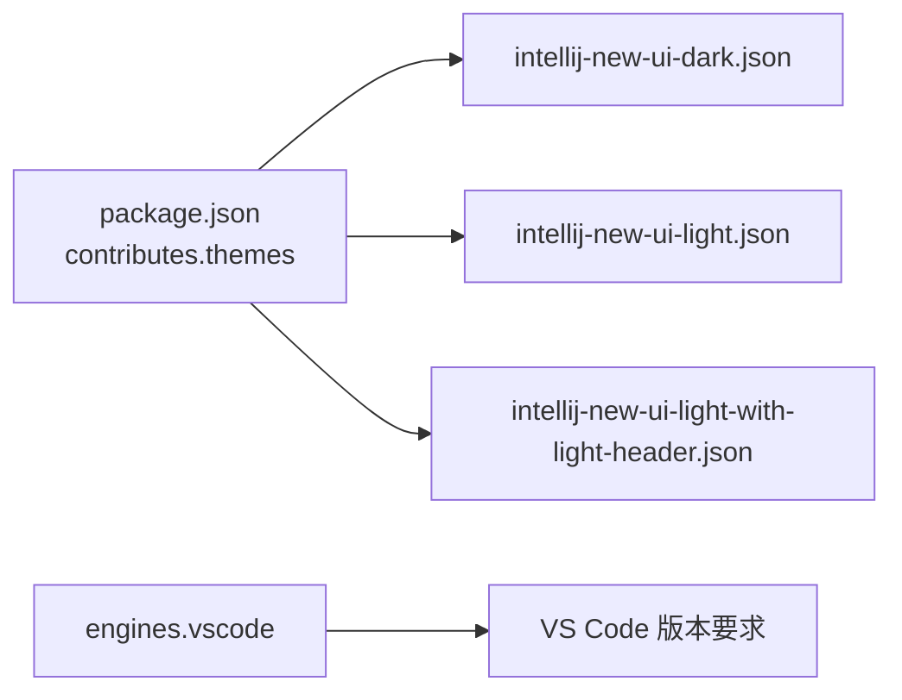

# 安装指南

<cite>
**本文引用的文件**
- [README.md](file://README.md)
- [package.json](file://package.json)
- [themes/intellij-new-ui-dark.json](file://themes/intellij-new-ui-dark.json)
- [themes/intellij-new-ui-light.json](file://themes/intellij-new-ui-light.json)
- [themes/intellij-new-ui-light-with-light-header.json](file://themes/intellij-new-ui-light-with-light-header.json)
</cite>

## 更新摘要
**变更内容**
- 更新了下载链接，指向新的发布者 `ferrymo`
- 确保 VS Code Marketplace 和 Open-VSX Registry 的链接正确无误
- 所有说明基于 README.md 中的信息，并转化为结构化、可操作的步骤

## 目录
1. [简介](#简介)
2. [项目结构](#项目结构)
3. [核心组件](#核心组件)
4. [架构总览](#架构总览)
5. [详细组件分析](#详细组件分析)
6. [依赖关系分析](#依赖关系分析)
7. [性能注意事项](#性能注意事项)
8. [故障排查指南](#故障排查指南)
9. [结论](#结论)

## 简介
本指南面向希望在 Visual Studio Code 中安装并使用“IntelliJ IDEA 新 UI 主题”的用户。该主题包包含三款主题：深色主题、浅色主题与“浅色主题（带浅色标题栏）”。您可以通过 VS Code 扩展市场一键安装，或从本地文件系统手动安装。安装完成后，可通过命令面板选择并应用任一主题。

## 项目结构
该仓库为 VS Code 主题扩展，核心内容包括：
- 主题定义文件：位于 themes/ 目录下，分别对应三款主题
- 扩展元数据：package.json 描述扩展名称、发布者、主题贡献项与关键词
- 使用说明与下载入口：README.md 提供预览图与市场链接

图表来源
- [package.json](file://package.json#L1-L44)
- [themes/intellij-new-ui-dark.json](file://themes/intellij-new-ui-dark.json#L1-L658)
- [themes/intellij-new-ui-light.json](file://themes/intellij-new-ui-light.json#L1-L738)
- [themes/intellij-new-ui-light-with-light-header.json](file://themes/intellij-new-ui-light-with-light-header.json#L1-L736)

章节来源
- [README.md](file://README.md#L1-L19)
- [package.json](file://package.json#L1-L44)

## 核心组件
- 扩展元数据与主题贡献
  - 扩展名称、发布者、版本、引擎要求、分类与关键词均在 package.json 中声明
  - 通过 contributes.themes 声明三款主题及其标签、UI 主题类型与路径
- 主题定义文件
  - 深色主题：intellij-new-ui-dark.json
  - 浅色主题：intellij-new-ui-light.json
  - 浅色主题（带浅色标题栏）：intellij-new-ui-light-with-light-header.json

章节来源
- [package.json](file://package.json#L1-L44)
- [themes/intellij-new-ui-dark.json](file://themes/intellij-new-ui-dark.json#L1-L658)
- [themes/intellij-new-ui-light.json](file://themes/intellij-new-ui-light.json#L1-L738)
- [themes/intellij-new-ui-light-with-light-header.json](file://themes/intellij-new-ui-light-with-light-header.json#L1-L736)

## 架构总览
下图展示了 VS Code 主题扩展的安装与应用流程：从扩展市场或本地安装到在 VS Code 中选择并应用主题。

图表来源
- [README.md](file://README.md#L1-L19)
- [package.json](file://package.json#L18-L36)

## 详细组件分析

### 安装方式一：VS Code 扩展市场一键安装
- 步骤
  - 在 VS Code 中打开扩展面板（快捷键：Ctrl+Shift+X）
  - 在搜索框中输入“IntelliJ IDEA New UI”
  - 点击安装按钮完成安装
- 下载入口
  - [VS Code Marketplace](https://marketplace.visualstudio.com/items?itemName=ferrymo.intellij-idea-new-ui-pretty)
  - [Open-VSX Registry](https://open-vsx.org/extension/ferrymo/intellij-idea-new-ui-pretty)

章节来源
- [README.md](file://README.md#L14-L18)
- [package.json](file://package.json#L1-L17)

### 安装方式二：从本地文件系统手动安装
- 步骤
  - 获取扩展源码或打包文件
  - 在 VS Code 中打开扩展面板（Ctrl+Shift+X）
  - 点击“从 VSIX 安装”，选择本地 .vsix 文件
  - 完成安装后重启 VS Code

章节来源
- [README.md](file://README.md#L14-L18)
- [package.json](file://package.json#L1-L17)

### 应用主题：通过命令面板选择主题
- 步骤
  - 打开命令面板（Ctrl+Shift+P）
  - 输入“Preferences: Color Theme”
  - 在弹出的主题列表中选择以下之一：
    - IntelliJ IDEA New UI Dark
    - IntelliJ IDEA New UI Light
    - IntelliJ IDEA New UI Light with Light Header
- 效果
  - VS Code 将加载对应主题定义文件并应用到编辑器、侧边栏、状态栏等界面元素

章节来源
- [package.json](file://package.json#L18-L36)

### 主题视觉差异说明
- IntelliJ IDEA New UI Dark
  - 面向深色界面偏好，整体配色偏暗，强调对比度与可读性
- IntelliJ IDEA New UI Light
  - 面向浅色界面偏好，整体明亮，适合长时间阅读与协作
- IntelliJ IDEA New UI Light with Light Header
  - 浅色主题基础上，将标题栏也设置为浅色，统一顶部区域风格

章节来源
- [themes/intellij-new-ui-dark.json](file://themes/intellij-new-ui-dark.json#L1-L658)
- [themes/intellij-new-ui-light.json](file://themes/intellij-new-ui-light.json#L1-L738)
- [themes/intellij-new-ui-light-with-light-header.json](file://themes/intellij-new-ui-light-with-light-header.json#L1-L736)

## 依赖关系分析
- 扩展与主题的关系
  - package.json 的 contributes.themes 指定三款主题的标签、UI 类型与路径
  - VS Code 加载扩展时会注册这些主题，使其出现在“颜色主题”列表中
- 外部依赖
  - VS Code 引擎版本要求在 engines 字段中声明
  - 扩展分类与关键词用于市场检索与展示

图表来源
- [package.json](file://package.json#L8-L13)
- [package.json](file://package.json#L18-L36)

章节来源
- [package.json](file://package.json#L8-L13)
- [package.json](file://package.json#L18-L36)

## 性能注意事项
- 主题切换对性能影响极小，主要涉及颜色与语法高亮的重绘
- 若在大型工作区中频繁切换主题，建议关闭不必要的预览与活动面板以减少重绘压力
- 如遇卡顿，可尝试禁用其他主题扩展或重启 VS Code

## 故障排查指南
- 症状：安装后在“颜色主题”列表中看不到新主题
  - 可能原因
    - 扩展未正确安装或未启用
    - VS Code 缓存导致主题未刷新
  - 解决方案
    - 确认扩展已显示为“已安装”
    - 重启 VS Code 后再次查看主题列表
    - 如仍不可见，重新安装扩展或从本地手动安装
- 症状：主题应用后界面异常或颜色不一致
  - 可能原因
    - 与其他主题扩展冲突
    - VS Code 版本过低（低于 engines 指定版本）
  - 解决方案
    - 禁用其他主题扩展，仅保留本主题
    - 升级 VS Code 至满足 engines 要求的版本
- 症状：命令面板无法找到“Preferences: Color Theme”
  - 可能原因
    - 快捷键或输入法问题
  - 解决方案
    - 使用 Ctrl+Shift+P 打开命令面板
    - 输入“Preferences: Color Theme”并回车

章节来源
- [README.md](file://README.md#L14-L18)
- [package.json](file://package.json#L8-L13)
- [package.json](file://package.json#L18-L36)

## 结论
通过本指南，您可以在 VS Code 中快速完成“IntelliJ IDEA New UI 主题”的安装与应用。若遇到问题，请优先确认扩展安装状态、重启 VS Code 并检查 VS Code 版本是否满足要求。根据个人偏好选择深色或浅色主题，获得更舒适的开发体验。