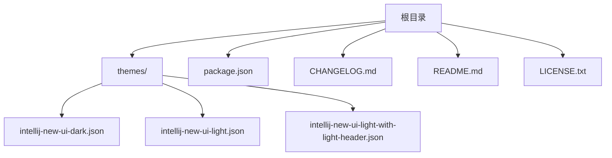
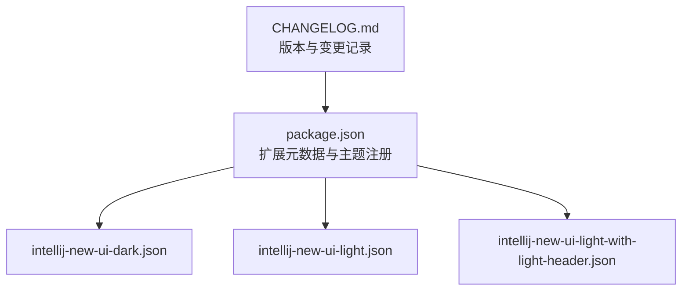
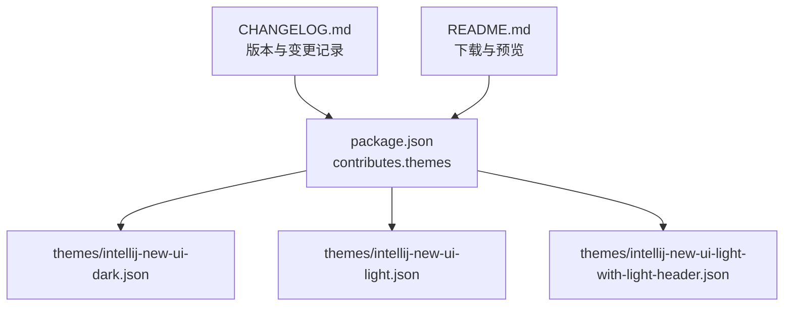

# 版本历史

<cite>
**本文引用的文件**
- [CHANGELOG.md](file://CHANGELOG.md)
- [package.json](file://package.json)
- [README.md](file://README.md)
- [LICENSE.txt](file://LICENSE.txt)
- [themes/intellij-new-ui-dark.json](file://themes/intellij-new-ui-dark.json)
- [themes/intellij-new-ui-light.json](file://themes/intellij-new-ui-light.json)
- [themes/intellij-new-ui-light-with-light-header.json](file://themes/intellij-new-ui-light-with-light-header.json)
</cite>

## 目录
1. [简介](#简介)
2. [项目结构](#项目结构)
3. [核心组件](#核心组件)
4. [架构总览](#架构总览)
5. [详细组件分析](#详细组件分析)
6. [依赖关系分析](#依赖关系分析)
7. [性能考量](#性能考量)
8. [故障排查指南](#故障排查指南)
9. [结论](#结论)
10. [附录](#附录)

## 简介
本版本历史文档系统梳理并呈现本仓库在 CHANGELOG.md 中记录的全部版本变更信息。当前仓库已发布至 v1.4.0，并在该版本中更新了扩展描述。早期版本（v1.3.0）完成了主题包的初始发布，包含深色、浅色以及“浅色标题栏变体”的三款主题。本文将按时间倒序列出每个发布版本，说明其新增功能、改进项与修复内容，并结合主题文件与贡献清单，解释这些变更对用户体验的影响及对开发者的参考价值。

## 项目结构
- 主题文件位于 themes/ 目录，包含三款 VS Code 主题：
  - 深色主题：intellij-new-ui-dark.json
  - 浅色主题：intellij-new-ui-light.json
  - 浅色主题（带浅色标题栏）：intellij-new-ui-light-with-light-header.json
- 扩展元数据与主题注册位于 package.json
- 变更日志与发布说明位于 CHANGELOG.md
- 项目简介与预览图位于 README.md
- 许可证信息位于 LICENSE.txt

图表来源
- [package.json](file://package.json#L1-L44)
- [themes/intellij-new-ui-dark.json](file://themes/intellij-new-ui-dark.json#L1-L668)
- [themes/intellij-new-ui-light.json](file://themes/intellij-new-ui-light.json#L1-L751)
- [themes/intellij-new-ui-light-with-light-header.json](file://themes/intellij-new-ui-light-with-light-header.json#L1-L749)

章节来源
- [package.json](file://package.json#L1-L44)
- [CHANGELOG.md](file://CHANGELOG.md#L1-L14)
- [README.md](file://README.md#L1-L19)

## 核心组件
- 版本与发布信息
  - 当前版本：v1.4.0
  - 最早版本：v1.3.0
- 主题集合
  - 深色主题：提供深色界面与高对比度编辑器区域
  - 浅色主题：提供明亮界面与清晰的编辑器与侧边栏配色
  - 浅色标题栏变体：将标题栏背景改为浅色，提升与浅色 UI 的一致性
- 扩展元数据
  - 支持 VS Code 引擎版本范围
  - 在市场与 Open-VSX 注册主题

章节来源
- [package.json](file://package.json#L1-L44)
- [CHANGELOG.md](file://CHANGELOG.md#L1-L14)

## 架构总览
下图展示从扩展元数据到主题文件的整体贡献关系，体现主题注册与版本控制之间的关联。

图表来源
- [package.json](file://package.json#L1-L44)
- [CHANGELOG.md](file://CHANGELOG.md#L1-L14)

## 详细组件分析

### 版本 v1.4.0（2025-07-19）
- 变更摘要
  - 更新扩展描述
- 对用户的影响
  - 更清晰地表达主题包的目标与风格，便于在市场中快速理解主题定位
- 对开发者的影响
  - 有助于统一对外说明口径，减少用户咨询成本

章节来源
- [CHANGELOG.md](file://CHANGELOG.md#L1-L14)

### 版本 v1.3.0（2025-07-17）
- 新增内容
  - 初始发布“IntelliJ IDEA New UI”主题包，包含以下三种变体：
    - 深色主题（Dark）
    - 浅色主题（Light）
    - 浅色标题栏变体（Light with Light Header）
- 对用户的影响
  - 提供与 IntelliJ IDEA 新界面风格一致的主题体验，覆盖深色与浅色偏好
  - 浅色标题栏变体改善了浅色模式下的标题栏视觉一致性
- 对开发者的影响
  - 通过 package.json 的 contributes.themes 字段完成主题注册，便于 VS Code 用户一键切换
  - README 展示了主题预览截图，便于用户直观评估

章节来源
- [CHANGELOG.md](file://CHANGELOG.md#L1-L14)
- [package.json](file://package.json#L1-L44)
- [README.md](file://README.md#L1-L19)

### 主题文件概览与差异
- 深色主题（intellij-new-ui-dark.json）
  - 类型：暗色
  - 关键特性：标题栏与活动栏采用深色背景，编辑器与面板使用深色系，强调与 VS Code 暗色主题的契合
- 浅色主题（intellij-new-ui-light.json）
  - 类型：亮色
  - 关键特性：整体明亮背景，编辑器与侧边栏采用浅色系，适合明亮工作环境
- 浅色标题栏变体（intellij-new-ui-light-with-light-header.json）
  - 类型：亮色
  - 关键特性：标题栏背景改为浅色，与浅色 UI 的标题栏保持一致，减少视觉割裂感

章节来源
- [themes/intellij-new-ui-dark.json](file://themes/intellij-new-ui-dark.json#L1-L668)
- [themes/intellij-new-ui-light.json](file://themes/intellij-new-ui-light.json#L1-L751)
- [themes/intellij-new-ui-light-with-light-header.json](file://themes/intellij-new-ui-light-with-light-header.json#L1-L749)

## 依赖关系分析
- 扩展与主题的绑定
  - package.json 的 contributes.themes 字段声明了三款主题的标签、UI 主题类型与路径，确保 VS Code 能正确加载与显示
- 版本与引擎兼容
  - engines.vscode 指定最低 VS Code 版本要求，保证主题在较新版本中具备最佳兼容性
- 发布与展示
  - README.md 提供下载入口与预览图，CHANGELOG.md 记录每次变更，形成完整的发布与传播闭环

图表来源
- [package.json](file://package.json#L1-L44)
- [CHANGELOG.md](file://CHANGELOG.md#L1-L14)
- [README.md](file://README.md#L1-L19)

章节来源
- [package.json](file://package.json#L1-L44)
- [CHANGELOG.md](file://CHANGELOG.md#L1-L14)
- [README.md](file://README.md#L1-L19)

## 性能考量
- 主题体积与加载
  - 主题文件为 JSON 结构，包含颜色与语义令牌配置。建议保持配置简洁，避免冗余颜色定义，以降低渲染开销
- 语法高亮与可读性
  - 不同语言的 tokenColors 配置会影响编辑器渲染效率。建议针对常用语言进行优化，确保高对比度与可读性的同时不引入过多样式层级
- 标题栏与面板一致性
  - 浅色标题栏变体通过统一标题栏背景，减少视觉跳变，间接提升界面感知流畅度

## 故障排查指南
- 主题未出现在主题列表
  - 检查 package.json 的 contributes.themes 是否正确声明三款主题路径与标签
- 主题切换后颜色异常
  - 检查对应主题 JSON 文件中的颜色键值是否被 VS Code 支持；必要时回退到默认颜色键
- 与 VS Code 版本不兼容
  - 查看 engines.vscode 的最低版本要求，升级 VS Code 至满足条件的版本
- 扩展描述过时
  - v1.4.0 已更新扩展描述，若仍显示旧描述，请重新安装或刷新扩展缓存

章节来源
- [package.json](file://package.json#L1-L44)
- [CHANGELOG.md](file://CHANGELOG.md#L1-L14)

## 结论
- 本主题包自 v1.3.0 起提供三款风格一致的主题，覆盖深色与浅色偏好，并在 v1.4.0 中完善了扩展描述，提升市场说明质量
- 对用户而言，可按个人偏好选择深色或浅色主题，浅色标题栏变体进一步优化了浅色模式下的视觉一致性
- 对开发者而言，主题注册与版本记录清晰，便于维护与迭代；建议在后续版本中继续关注语法高亮准确性与 VS Code 兼容性

## 附录
- 许可证
  - 本项目采用 MIT 许可证，允许自由使用、复制、修改与分发，但需保留版权与许可声明

章节来源
- [LICENSE.txt](file://LICENSE.txt#L1-L23)