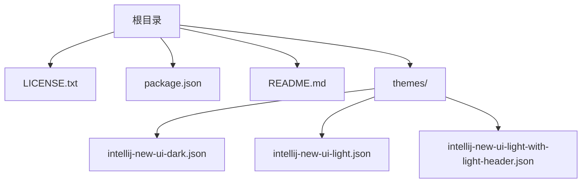
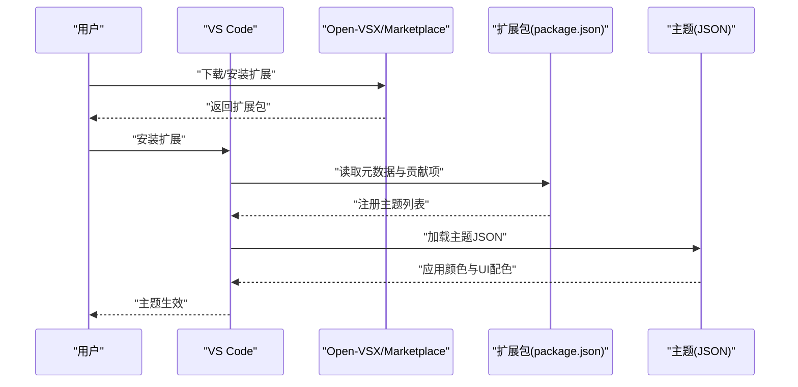
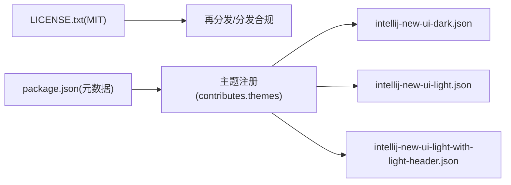

# 许可证信息

<cite>
**本文引用的文件**
- [LICENSE.txt](file://LICENSE.txt)
- [package.json](file://package.json)
- [README.md](file://README.md)
- [themes/intellij-new-ui-dark.json](file://themes/intellij-new-ui-dark.json)
- [themes/intellij-new-ui-light.json](file://themes/intellij-new-ui-light.json)
- [themes/intellij-new-ui-light-with-light-header.json](file://themes/intellij-new-ui-light-with-light-header.json)
</cite>

## 目录
1. [简介](#简介)
2. [项目结构](#项目结构)
3. [核心组件](#核心组件)
4. [架构总览](#架构总览)
5. [详细组件分析](#详细组件分析)
6. [依赖分析](#依赖分析)
7. [性能考虑](#性能考虑)
8. [故障排查指南](#故障排查指南)
9. [结论](#结论)
10. [附录](#附录)

## 简介
本文件旨在为 vscode-intellij-idea-new-ui-pretty 项目提供清晰、可操作的许可证信息与合规指引。根据仓库中的 LICENSE.txt 文件，该项目采用 MIT 许可证。MIT 许可证属于宽松型开源许可证，允许在商业与非商业环境中自由使用、复制、修改、分发、再授权等，同时要求保留原始版权声明与许可声明。本文将逐条解析该许可证赋予的权利与义务，并给出面向个人用户与企业的合规建议，帮助用户在不承担版权风险的前提下合法使用本扩展主题包。

## 项目结构
本项目围绕 VS Code 主题包组织，包含以下关键文件：
- 许可证文件：LICENSE.txt
- 扩展元数据：package.json
- 使用说明：README.md
- 主题定义：三个 JSON 主题文件（深色、浅色、浅色带浅色标题栏）

图表来源
- [LICENSE.txt](file://LICENSE.txt#L1-L23)
- [package.json](file://package.json#L1-L44)
- [README.md](file://README.md#L1-L19)
- [themes/intellij-new-ui-dark.json](file://themes/intellij-new-ui-dark.json#L1-L200)

章节来源
- [LICENSE.txt](file://LICENSE.txt#L1-L23)
- [package.json](file://package.json#L1-L44)
- [README.md](file://README.md#L1-L19)

## 核心组件
- 许可证主体：MIT 许可证文本位于 LICENSE.txt，明确了版权归属、许可授予与免责声明。
- 扩展元数据：package.json 描述了扩展名称、版本、引擎兼容性、贡献的主题列表以及仓库链接等，便于识别与分发。
- 主题资源：三个主题 JSON 文件分别定义了 VS Code 的颜色与 UI 组件配色方案，供 VS Code 加载使用。

章节来源
- [LICENSE.txt](file://LICENSE.txt#L1-L23)
- [package.json](file://package.json#L1-L44)
- [themes/intellij-new-ui-dark.json](file://themes/intellij-new-ui-dark.json#L1-L200)
- [themes/intellij-new-ui-light.json](file://themes/intellij-new-ui-light.json#L1-L200)
- [themes/intellij-new-ui-light-with-light-header.json](file://themes/intellij-new-ui-light-with-light-header.json#L1-L200)

## 架构总览
下图展示了从用户安装到主题生效的整体流程，以及许可证在其中的作用边界：用户通过 VS Code 或 Open-VSX 安装扩展后，扩展内的主题 JSON 被加载至编辑器；MIT 许可证确保用户可在遵守“保留版权与许可声明”的前提下自由使用这些主题。

图表来源
- [package.json](file://package.json#L1-L44)
- [themes/intellij-new-ui-dark.json](file://themes/intellij-new-ui-dark.json#L1-L200)
- [themes/intellij-new-ui-light.json](file://themes/intellij-new-ui-light.json#L1-L200)
- [themes/intellij-new-ui-light-with-light-header.json](file://themes/intellij-new-ui-light-with-light-header.json#L1-L200)

## 详细组件分析

### 许可证条款解析（MIT）
- 许可证类型：MIT 许可证
- 版权声明与许可授予：项目作者保留所有权利，并授予任何人免费获得软件及其相关文档的副本，并在不受限制的情况下使用、复制、修改、合并、发布、分发、再许可及销售软件副本的权利。
- 条件要求：必须在软件的所有副本或重要部分中包含原始版权通知与许可通知。
- 免责声明：软件按“现状”提供，不提供任何明示或暗示的担保，作者或版权所有者不对因使用或无法使用软件而产生的任何索赔、损害或其他责任负责。

合规要点
- 个人用户：可直接在本地 VS Code 中安装并使用，无需支付费用；若二次分发，请务必保留 LICENSE.txt 与 package.json 中的版权与许可信息。
- 企业用户：可在内部项目与产品中使用该主题包，无需公开源码或支付费用；若将扩展打包进自有产品进行分发，需保留 LICENSE.txt 与 package.json 的版权与许可信息。

章节来源
- [LICENSE.txt](file://LICENSE.txt#L1-L23)

### 扩展元数据与主题贡献
- 扩展名称、版本、引擎兼容性、关键字、主页与仓库地址均在 package.json 中定义，便于用户识别来源与正确安装。
- contributes.themes 列表注册了三款主题，分别对应深色、浅色与浅色带浅色标题栏的 UI 风格，供用户选择。

章节来源
- [package.json](file://package.json#L1-L44)

### 主题文件结构
- 每个主题 JSON 文件定义了 VS Code 的颜色映射与 UI 组件样式，覆盖标题栏、侧边栏、编辑器、状态栏、终端、通知等区域的颜色配置。
- 该结构由 VS Code 主题规范驱动，扩展通过 package.json 的 contributes.themes 将这些 JSON 注册为可用主题。

章节来源
- [themes/intellij-new-ui-dark.json](file://themes/intellij-new-ui-dark.json#L1-L200)
- [themes/intellij-new-ui-light.json](file://themes/intellij-new-ui-light.json#L1-L200)
- [themes/intellij-new-ui-light-with-light-header.json](file://themes/intellij-new-ui-light-with-light-header.json#L1-L200)

## 依赖分析
- 许可证依赖：MIT 许可证要求在分发或再分发时保留版权与许可声明，这是使用本扩展包的前提条件。
- 扩展依赖：package.json 指定 VS Code 引擎版本范围，确保在目标版本上正常加载主题。
- 主题依赖：各主题 JSON 文件独立存在，但通过 package.json 的 contributes.themes 与 VS Code 主题系统耦合。

图表来源
- [LICENSE.txt](file://LICENSE.txt#L1-L23)
- [package.json](file://package.json#L1-L44)
- [themes/intellij-new-ui-dark.json](file://themes/intellij-new-ui-dark.json#L1-L200)
- [themes/intellij-new-ui-light.json](file://themes/intellij-new-ui-light.json#L1-L200)
- [themes/intellij-new-ui-light-with-light-header.json](file://themes/intellij-new-ui-light-with-light-header.json#L1-L200)

章节来源
- [LICENSE.txt](file://LICENSE.txt#L1-L23)
- [package.json](file://package.json#L1-L44)

## 性能考虑
- 许可证本身不影响代码性能，但合规分发可避免法律纠纷带来的间接成本。
- 主题 JSON 文件体积较大（数百行键值对），建议在本地使用时保持原样，避免不必要的修改；如需二次开发，建议仅调整必要颜色值并保留版权与许可信息。

## 故障排查指南
- 安装后主题未显示
  - 检查 VS Code 引擎版本是否满足 package.json 中的 engines 字段要求。
  - 在设置中确认已选择对应的 IntelliJ IDEA 新 UI 主题。
- 分发或二次打包时出现合规问题
  - 确保随分发包包含 LICENSE.txt 与 package.json，并在显著位置标注版权与许可信息。
  - 若修改了主题 JSON，请保留原始版权与许可声明，避免删除或篡改。

章节来源
- [package.json](file://package.json#L1-L44)
- [LICENSE.txt](file://LICENSE.txt#L1-L23)

## 结论
vscode-intellij-idea-new-ui-pretty 项目采用 MIT 许可证，允许个人与企业用户在遵守“保留版权与许可声明”的前提下自由使用、复制、修改、分发与再授权。对于个人用户，可直接在本地 VS Code 中安装使用；对于企业用户，可在自有产品中使用该主题包，无需公开源码或支付费用。为避免版权风险，建议在分发或二次打包时保留 LICENSE.txt 与 package.json 的版权与许可信息，并在显著位置标注来源。

## 附录
- 法律合规清单（建议）
  - 保留 LICENSE.txt 原文与版权信息
  - 保留 package.json 中的版权与许可信息
  - 在分发包中提供 LICENSE.txt 与 package.json
  - 如二次修改主题 JSON，请保留原始版权与许可声明
  - 在产品文档中标注主题来源与许可证类型