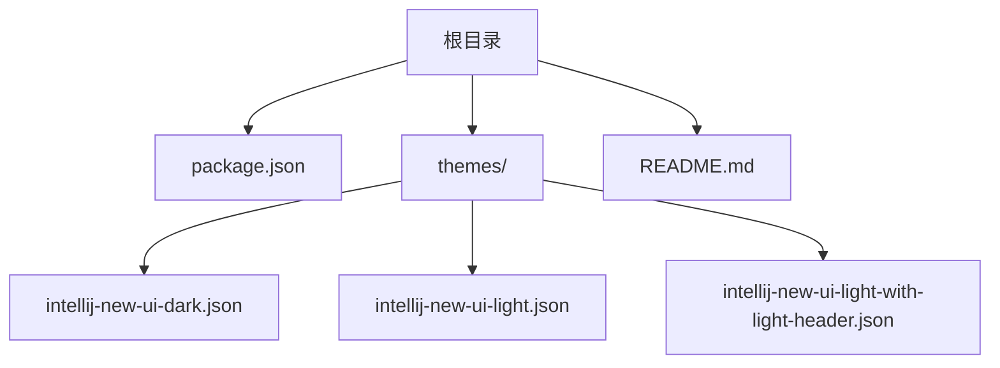
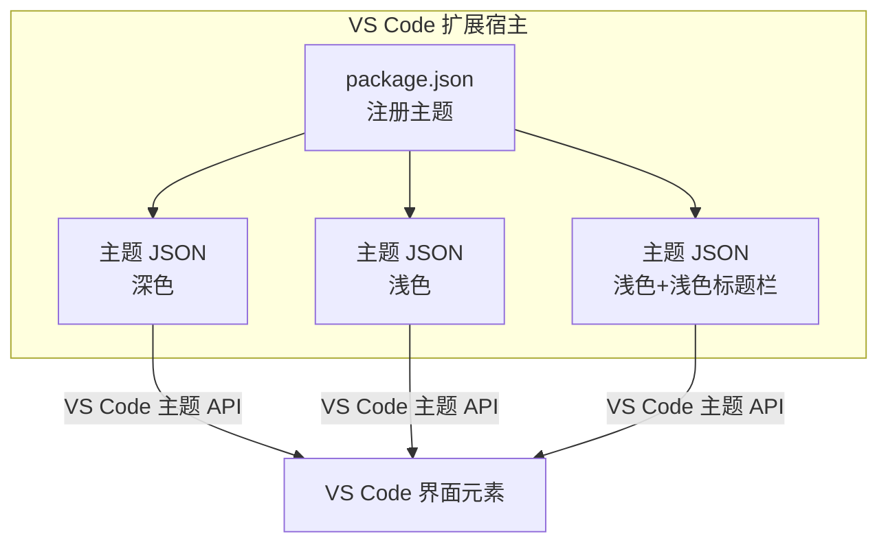
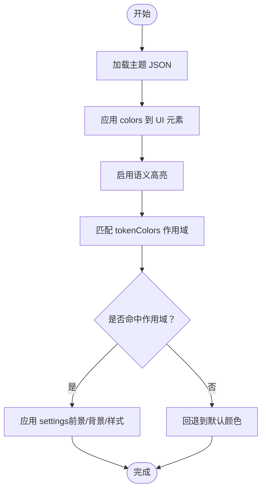
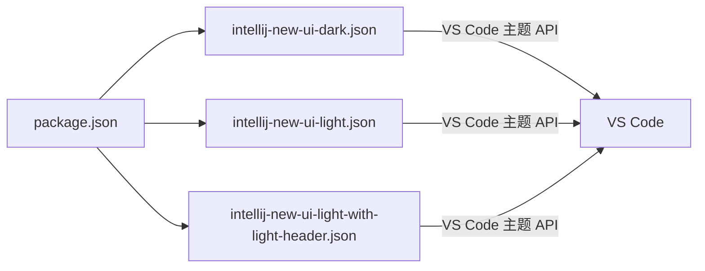

# 项目概述

<cite>
**本文引用的文件**
- [README.md](file://README.md)
- [package.json](file://package.json)
- [themes/intellij-new-ui-dark.json](file://themes/intellij-new-ui-dark.json)
- [themes/intellij-new-ui-light.json](file://themes/intellij-new-ui-light.json)
- [themes/intellij-new-ui-light-with-light-header.json](file://themes/intellij-new-ui-light-with-light-header.json)
</cite>

## 目录
1. [简介](#简介)
2. [项目结构](#项目结构)
3. [核心组件](#核心组件)
4. [架构总览](#架构总览)
5. [详细组件分析](#详细组件分析)
6. [依赖关系分析](#依赖关系分析)
7. [性能考量](#性能考量)
8. [故障排查指南](#故障排查指南)
9. [结论](#结论)
10. [附录](#附录)

## 简介
本项目是一个为 VS Code 设计的主题扩展包，目标是复刻 IntelliJ IDEA 新界面的视觉风格。它提供三种主题变体：
- 深色主题：适用于夜间或低光环境，强调对比度与可读性。
- 浅色主题：默认浅色界面，适合明亮环境与偏好浅色的用户。
- 浅色主题（带浅色标题栏）：在浅色主界面基础上，将标题栏也设为浅色，统一整体色调。

该扩展采用“配置驱动”的模块化架构，完全通过 JSON 文件定义 UI 样式与语法高亮规则，不包含任何运行时依赖，确保安装即用、体积小、维护成本低。

根据 README 描述，项目已在 VS Code 市场与 Open-VSX 注册，用户可通过官方市场或 Open-VSX 安装使用。

**章节来源**
- file://README.md#L1-L19

## 项目结构
项目采用极简结构，核心由一个 package.json 和三个主题 JSON 文件组成：
- package.json：声明扩展元数据、VS Code 引擎版本要求、分类、图标与画廊横幅，并通过 contributes.themes 注册三款主题。
- themes/：存放三个主题 JSON 文件，分别对应三种变体。

**图表来源**
- [package.json](file://package.json#L1-L44)
- [themes/intellij-new-ui-dark.json](file://themes/intellij-new-ui-dark.json#L1-L658)
- [themes/intellij-new-ui-light.json](file://themes/intellij-new-ui-light.json#L1-L738)
- [themes/intellij-new-ui-light-with-light-header.json](file://themes/intellij-new-ui-light-with-light-header.json#L1-L736)

**章节来源**
- file://package.json#L1-L44

## 核心组件
- 扩展清单与注册
  - package.json 使用 contributes.themes 注册三款主题，每条记录指定主题标签名、UI 主题类型（vs-dark 或 vs）、以及主题 JSON 的相对路径。
  - engines 字段限制最低 VS Code 版本，确保兼容性。
  - categories、keywords、icon、galleryBanner 等字段提升市场可见性与安装体验。
- 主题 JSON 文件
  - 每个主题 JSON 包含 color-theme 规范所需字段：$schema、type、colors、tokenColors、semanticHighlighting、semanticTokenColors 等。
  - colors 覆盖 VS Code UI 各区域的颜色，如标题栏、菜单、侧边栏、活动栏、状态栏、编辑器、面板、列表、Git 装饰等。
  - tokenColors 定义语法高亮规则，按语言与作用域分组，设置前景色、背景色与字体样式。
  - semanticHighlighting 与 semanticTokenColors 支持语义高亮，对变量、类型、类、接口、属性等进行更细粒度的着色。

**章节来源**
- file://package.json#L18-L36
- file://themes/intellij-new-ui-dark.json#L1-L658
- file://themes/intellij-new-ui-light.json#L1-L738
- file://themes/intellij-new-ui-light-with-light-header.json#L1-L736

## 架构总览
该扩展采用“配置驱动 + VS Code 主题 API”的轻量级架构：
- package.json 作为入口，负责向 VS Code 注册主题。
- 每个主题 JSON 文件作为独立的 color-theme 配置，直接被 VS Code 加载与应用。
- 无需编译或运行时依赖，主题切换即即时生效。

**图表来源**
- [package.json](file://package.json#L18-L36)
- [themes/intellij-new-ui-dark.json](file://themes/intellij-new-ui-dark.json#L1-L658)
- [themes/intellij-new-ui-light.json](file://themes/intellij-new-ui-light.json#L1-L738)
- [themes/intellij-new-ui-light-with-light-header.json](file://themes/intellij-new-ui-light-with-light-header.json#L1-L736)

## 详细组件分析

### 组件一：主题注册与贡献（package.json）
- 主要职责
  - 声明扩展名称、发布者、显示名、描述、图标、版本、引擎版本、分类、关键词、主页与仓库信息。
  - 通过 contributes.themes 注册三款主题，分别指向三个主题 JSON 文件。
  - 设置 galleryBanner 以优化市场展示。
- 关键字段说明
  - name/publisher/displayName/description/icon/version：扩展标识与元信息。
  - engines.vscode：限定最低 VS Code 版本。
  - categories：主题分类，便于市场归类。
  - keywords：搜索关键词，提升发现率。
  - homepage/repository：项目主页与仓库地址。
  - contributes.themes：注册主题数组，每项包含 label、uiTheme、path。
- 适用场景
  - 快速集成 IntelliJ IDEA 风格到 VS Code。
  - 为不同光照条件与个人偏好提供多套配色方案。
- 用户体验价值
  - 一键安装，立即获得一致的 IDE 外观。
  - 通过浅色标题栏选项减少视觉割裂感，提升整体协调性。

**章节来源**
- file://package.json#L1-L44

### 组件二：深色主题（intellij-new-ui-dark.json）
- 主题类型与基础色彩
  - type 为 dark，colors 中覆盖标题栏、菜单、命令中心、侧边栏、活动栏、输入框、按钮、徽章、Git 装饰、面板、终端、下拉框、问题图标、状态栏、通知、编辑器组、标签页、面包屑、滚动条、调试图标、编辑器、编辑器挂起提示、编辑器标尺、编辑器链接、编辑器查找与选择高亮、搜索编辑器、编辑器小部件、编辑器概览标尺、迷你地图、差异编辑器、预览视图、合并编辑器、文本链接、设置页面、欢迎页等区域。
- 语法高亮与语义高亮
  - semanticHighlighting 开启语义高亮。
  - semanticTokenColors 定义命名空间、变量、参数、类型参数、类型、接口、类、属性等的前景色与字体样式。
  - tokenColors 以数组形式定义各类语言元素的高亮规则，涵盖注释、关键字、存储、常量、变量、字符串、正则、函数、类、属性、操作符、HTML/CSS/JS/Markdown 等。
- 性能与复杂度
  - JSON 结构线性扫描匹配 tokenColors，时间复杂度与规则数量成正比；建议保持规则精炼，避免过度嵌套与冗余作用域。
- 错误处理与边界
  - 若某 UI 元素未在 colors 中显式定义，VS Code 将回退到默认主题颜色。
  - tokenColors 中未命中的语法元素将使用编辑器默认前景色。

**章节来源**
- file://themes/intellij-new-ui-dark.json#L1-L658

### 组件三：浅色主题（intellij-new-ui-light.json）
- 主题类型与基础色彩
  - type 为 light，colors 覆盖编辑器、侧边栏、标签页、活动栏、状态栏、标题栏、命令中心、面板、列表、调试工具栏、Git 装饰、终端 ANSI 颜色等区域。
- 语法高亮与语义高亮
  - semanticHighlighting 开启语义高亮。
  - semanticTokenColors 提供类与接口的语义高亮配置（例如是否加粗）。
  - tokenColors 定义注释、无效标记、运算符、关键字、类型、语言常量、变量、函数、类、异常、章节、数字字符、字符串、转义序列、正则、符号、HTML/CSS/JS/Markdown 等的高亮规则。
- 性能与复杂度
  - 与深色主题类似，tokenColors 数量影响匹配开销；建议按需配置，减少重复与冲突。
- 错误处理与边界
  - 未定义的颜色将回退至默认浅色主题配色。
  - 未命中 tokenColors 的语法元素使用编辑器默认前景色。

**章节来源**
- file://themes/intellij-new-ui-light.json#L1-L738

### 组件四：浅色主题（带浅色标题栏）
- 主题类型与基础色彩
  - type 为 light，colors 覆盖编辑器、侧边栏、标签页、活动栏、状态栏、标题栏（浅色）、命令中心、面板、列表、调试工具栏、Git 装饰、终端 ANSI 颜色等区域。
- 语法高亮与语义高亮
  - semanticHighlighting 开启语义高亮。
  - semanticTokenColors 提供类与接口的语义高亮配置。
  - tokenColors 定义注释、无效标记、运算符、关键字、类型、语言常量、变量、函数、类、异常、章节、数字字符、字符串、转义序列、正则、符号、HTML/CSS/JS/Markdown 等的高亮规则。
- 适用场景
  - 偏好浅色主界面但希望标题栏也保持浅色，减少视觉分割感。
- 性能与复杂度
  - 与浅色主题相同，注意规则数量与作用域粒度。
- 错误处理与边界
  - 未定义的颜色将回退至默认浅色主题配色。
  - 未命中 tokenColors 的语法元素使用编辑器默认前景色。

**章节来源**
- file://themes/intellij-new-ui-light-with-light-header.json#L1-L736

### 语义高亮与 tokenColors 结构（概念性说明）
- 语义高亮（semanticHighlighting）
  - 通过 semanticTokenColors 对变量、类型、类、接口、属性等进行语义级着色，提升代码可读性与一致性。
- tokenColors 结构
  - 以数组形式组织，每个元素包含 name、scope 与 settings。
  - scope 可为单一字符串或数组，用于匹配语法树节点或语言特定作用域。
  - settings 支持 foreground、background、fontStyle 等属性。
- 颜色继承机制（概念性说明）
  - 当某个 UI 元素或语法元素未在当前主题中显式定义时，VS Code 将回退到默认主题或父级主题的对应值。
  - 在多主题共存环境中，后加载的主题会覆盖先前主题的同名定义。

[此图为概念流程图，不直接映射具体源文件，故无图表来源]

## 依赖关系分析
- 内部依赖
  - package.json 依赖三个主题 JSON 文件的存在与正确路径。
  - 三个主题 JSON 文件彼此独立，互不依赖。
- 外部依赖
  - 无运行时依赖，仅依赖 VS Code 主题 API。
- 潜在耦合点
  - 三款主题共享相似的 UI 区域命名，便于统一维护；若某 UI 区域在某一主题中缺失定义，可能在其他主题中表现不一致，应统一补齐。

**图表来源**
- [package.json](file://package.json#L18-L36)
- [themes/intellij-new-ui-dark.json](file://themes/intellij-new-ui-dark.json#L1-L658)
- [themes/intellij-new-ui-light.json](file://themes/intellij-new-ui-light.json#L1-L738)
- [themes/intellij-new-ui-light-with-light-header.json](file://themes/intellij-new-ui-light-with-light-header.json#L1-L736)

**章节来源**
- file://package.json#L18-L36

## 性能考量
- 主题加载
  - JSON 文件体积较小，加载与解析开销极低。
- 语法高亮匹配
  - tokenColors 数组线性扫描，规则越多匹配越慢；建议：
    - 合理拆分语言规则，避免过宽的作用域。
    - 减少重复与冲突规则，优先使用更具体的 scope。
- UI 渲染
  - colors 中的颜色覆盖范围广，但均为静态值，渲染开销可忽略。
- 建议
  - 保持主题 JSON 的简洁性，定期清理未使用的颜色与规则。
  - 在新增语言支持时，先在本地测试 tokenColors 的匹配效率。

[本节为通用性能指导，不直接分析具体文件，故无章节来源]

## 故障排查指南
- 主题未出现在主题列表
  - 检查 package.json 中 contributes.themes 的路径是否正确，且文件存在。
  - 确认 VS Code 版本满足 engines.vscode 要求。
- 主题切换后某些 UI 元素颜色异常
  - 检查对应主题 JSON 的 colors 是否缺少相关键值；VS Code 会回退到默认主题颜色。
  - 若使用自定义 UI 扩展，确认其颜色覆盖优先级。
- 语法高亮不生效或不准确
  - 检查 tokenColors 的 scope 是否与当前语言的语法作用域一致。
  - 避免过于宽泛的作用域导致与其他规则冲突。
- 语义高亮未生效
  - 确认 semanticHighlighting 已开启。
  - 某些语言服务器或扩展可能覆盖语义高亮，需在语言设置中调整。

**章节来源**
- file://package.json#L8-L10
- file://themes/intellij-new-ui-dark.json#L285-L330
- file://themes/intellij-new-ui-light.json#L729-L738
- file://themes/intellij-new-ui-light-with-light-header.json#L727-L736

## 结论
本项目以极简而清晰的方式实现了 IntelliJ IDEA 新界面风格的主题扩展。通过 package.json 注册与三个主题 JSON 文件的配置驱动，用户可在 VS Code 中快速切换深色、浅色与浅色标题栏三种风格。主题完全基于 JSON，不依赖运行时，安装即用、易于维护。对于初学者，可直接安装并选择合适主题；对于高级用户，可通过调整 colors 与 tokenColors 实现更精细的定制。

[本节为总结性内容，不直接分析具体文件，故无章节来源]

## 附录
- 适用场景
  - 偏好 JetBrains 生态风格的 VS Code 用户。
  - 需要在不同光照条件下切换主题的开发者。
  - 追求统一 UI 风格与一致语法高亮的专业用户。
- 用户体验价值
  - 降低视觉疲劳，提升长时间编码的舒适度。
  - 统一的 UI 风格减少认知负担，提高开发效率。
  - 语义高亮与丰富的 tokenColors 提升代码可读性与辨识度。

[本节为通用说明，不直接分析具体文件，故无章节来源]